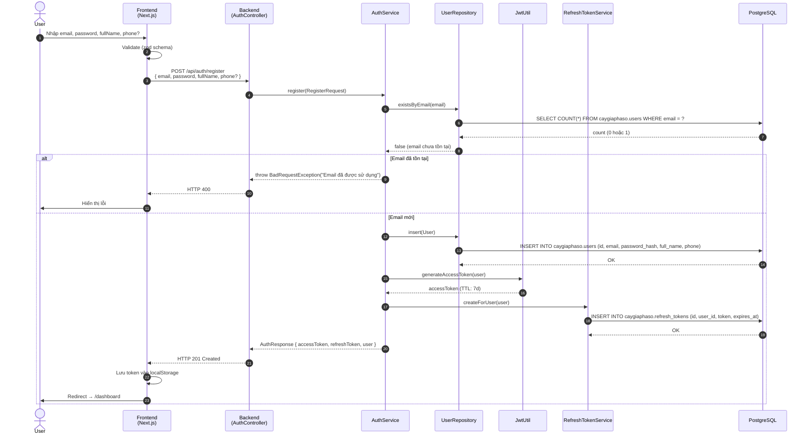
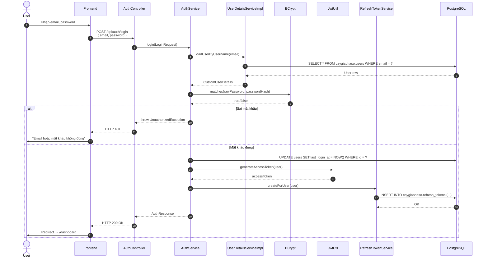
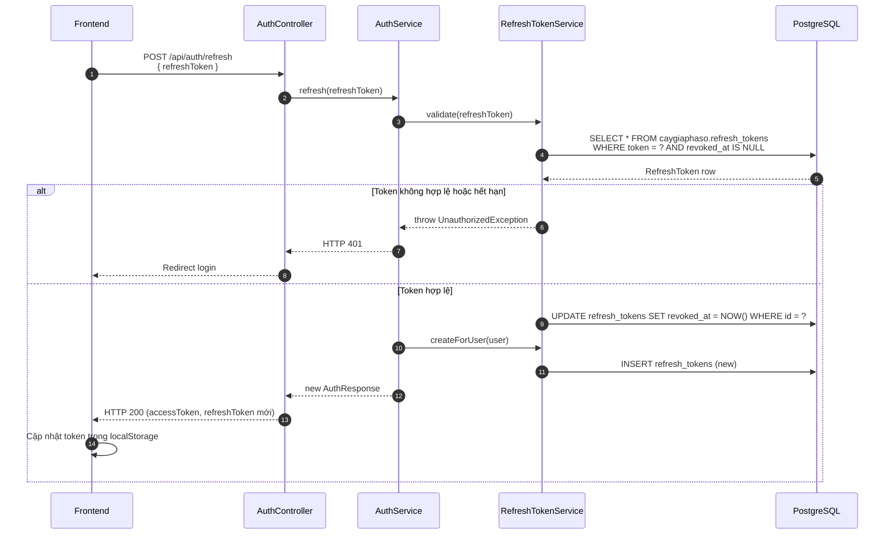
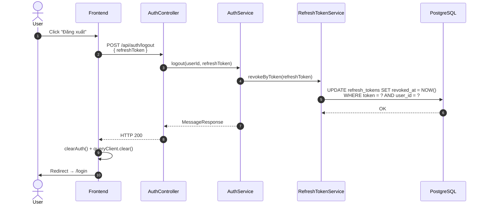
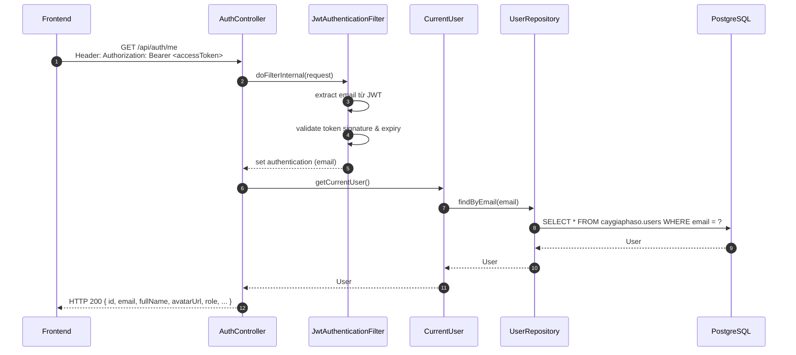

# Luồng 1: Xác thực & Phân quyền (Authentication & Authorization)

## Mô tả nghiệp vụ

Luồng Authentication quản lý vòng đời của người dùng trong hệ thống:
- Đăng ký tài khoản mới (email + password + fullName + phone?)
- Đăng nhập (nhận access token + refresh token)
- Refresh access token khi hết hạn (7 ngày)
- Đăng xuất (revoke refresh token)
- Lấy thông tin user hiện tại (`/auth/me`)

Mật khẩu được hash bằng **BCrypt**. JWT chứa email làm `sub` claim. Refresh token lưu DB với TTL.

## Sequence Diagram

### 1.1. Đăng ký (Register)



### 1.2. Đăng nhập (Login)



### 1.3. Refresh Token



### 1.4. Đăng xuất (Logout)



### 1.5. Lấy thông tin user hiện tại (`/auth/me`)



## API Endpoints liên quan

| Method | Path | Mô tả | Auth |
|--------|------|-------|------|
| `POST` | `/api/auth/register` | Đăng ký | ❌ |
| `POST` | `/api/auth/login` | Đăng nhập | ❌ |
| `POST` | `/api/auth/refresh` | Refresh token | ❌ |
| `POST` | `/api/auth/logout` | Đăng xuất | ✅ |
| `GET` | `/api/auth/me` | User hiện tại | ✅ |
| `GET` | `/api/users/search?q=` | Tìm user theo email/tên | ✅ |
| `GET` | `/api/users/{id}` | Lấy user theo ID | ✅ |
| `PUT` | `/api/users/me` | Cập nhật profile | ✅ |

## Bảng DB liên quan

- `caygiaphaso.users` - lưu user (id, email, password_hash, full_name, phone, bio, ...)
- `caygiaphaso.refresh_tokens` - lưu refresh token (id, user_id, token, expires_at, revoked_at)

## SQL mẫu để test

```sql
-- 1. Liệt kê tất cả user đã đăng ký
SELECT id, email, full_name, phone, last_login_at, created_at
FROM caygiaphaso.users;

-- 2. Đếm user đã đăng nhập trong 7 ngày qua
SELECT COUNT(*) AS active_users_7d
FROM caygiaphaso.users
WHERE last_login_at > NOW() - INTERVAL '7 days';

-- 3. Tìm refresh token sắp hết hạn (cần purge)
SELECT user_id, expires_at, revoked_at
FROM caygiaphaso.refresh_tokens
WHERE expires_at < NOW() + INTERVAL '1 day'
  AND revoked_at IS NULL;

-- 4. Đếm số session đang active của mỗi user
SELECT u.email, COUNT(rt.id) AS active_sessions
FROM caygiaphaso.users u
LEFT JOIN caygiaphaso.refresh_tokens rt
  ON rt.user_id = u.id
  AND rt.revoked_at IS NULL
  AND rt.expires_at > NOW()
GROUP BY u.id, u.email
ORDER BY active_sessions DESC;
```

## Edge cases & luật phân quyền

1. **Email trùng**: 400 BadRequest "Email đã được sử dụng"
2. **Sai password**: 401 Unauthorized "Email hoặc mật khẩu không đúng" (mật khẩu sai → message chung chung, không lộ email tồn tại)
3. **JWT hết hạn**: Frontend tự động gọi `/auth/refresh`; nếu fail → redirect `/login?redirect=...`
4. **Refresh token đã revoke**: 401 → buộc login lại
5. **Refresh token rotation**: Mỗi lần refresh, token cũ bị revoke, token mới được tạo
6. **Password requirements**: tối thiểu 8 ký tự (validation ở cả FE và BE)
7. **Email format**: phải đúng format email (zod regex ở FE + Bean Validation ở BE)

## Test cases cho tester

### T1: Đăng ký thành công
```bash
curl -X POST http://localhost:8080/api/auth/register \
  -H "Content-Type: application/json" \
  -d '{"email":"test@example.com","password":"password123","fullName":"Nguyen Van A","phone":"0123456789"}'
```
Expected: HTTP 201, response chứa `accessToken`, `refreshToken`, `user`.

### T2: Đăng ký email trùng
```bash
# Sau khi T1 đã chạy
curl -X POST http://localhost:8080/api/auth/register \
  -H "Content-Type: application/json" \
  -d '{"email":"test@example.com","password":"password456","fullName":"Tran Thi B"}'
```
Expected: HTTP 400, message "Email đã được sử dụng".

### T3: Đăng nhập sai password
```bash
curl -X POST http://localhost:8080/api/auth/login \
  -H "Content-Type: application/json" \
  -d '{"email":"test@example.com","password":"wrongpass"}'
```
Expected: HTTP 401.

### T4: Đăng nhập thành công + lấy thông tin
```bash
TOKEN=$(curl -s -X POST http://localhost:8080/api/auth/login \
  -H "Content-Type: application/json" \
  -d '{"email":"test@example.com","password":"password123"}' \
  | jq -r '.accessToken')

curl -X GET http://localhost:8080/api/auth/me \
  -H "Authorization: Bearer $TOKEN"
```
Expected: HTTP 200, trả về user object.

### T5: Refresh token
```bash
REFRESH=$(curl -s -X POST http://localhost:8080/api/auth/login ... | jq -r '.refreshToken')

curl -X POST http://localhost:8080/api/auth/refresh \
  -H "Content-Type: application/json" \
  -d "{\"refreshToken\":\"$REFRESH\"}"
```
Expected: HTTP 200, nhận token mới.

### T6: Truy cập API không có token
```bash
curl -X GET http://localhost:8080/api/auth/me
```
Expected: HTTP 401.

## Bài học SQL

1. **Index hiệu năng**: `idx_users_email` (unique) cho phép lookup email nhanh.
2. **Password storage**: KHÔNG BAO GIỜ lưu plain text — luôn hash với BCrypt.
3. **Token rotation**: pattern refresh token rotation giúp phát hiện token bị đánh cắp.
4. **Soft vs hard delete**: refresh_tokens dùng `revoked_at` thay vì DELETE row.
5. **TTL management**: cần scheduled job để purge expired tokens (xem `RefreshTokenService.purgeExpiredAndRevoked`).