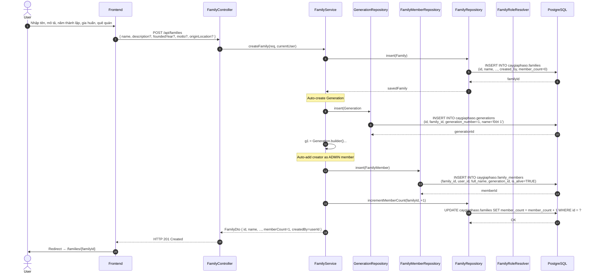
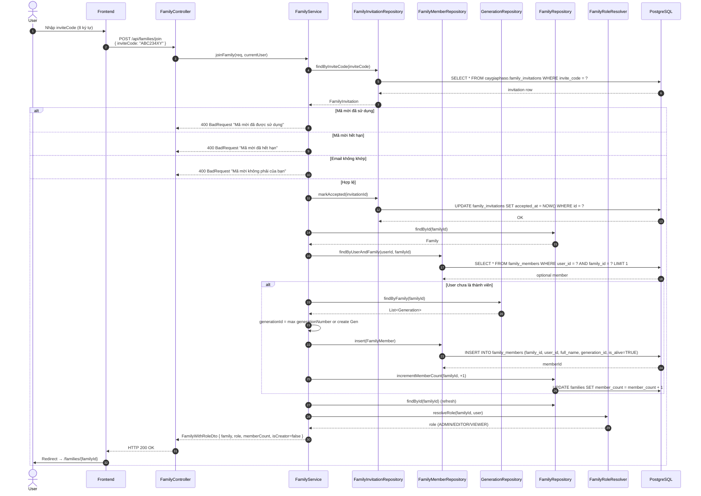
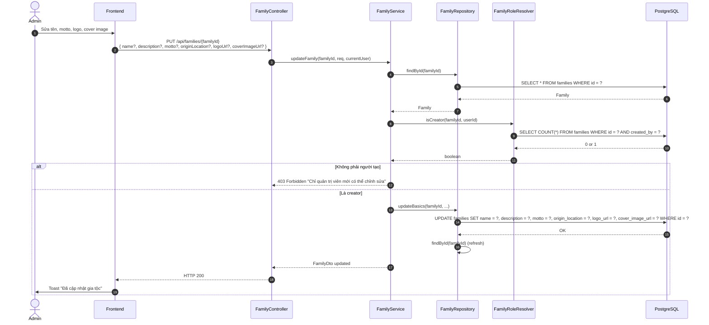
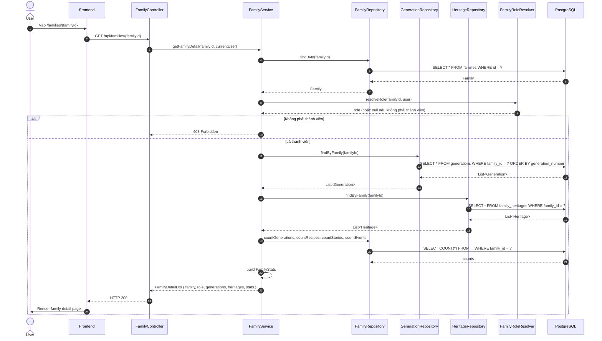

# Luồng 2: Quản lý Gia tộc (Family Management)

## Mô tả nghiệp vụ

Luồng quản lý gia tộc cho phép:
- Tạo gia tộc mới (creator tự động trở thành ADMIN)
- Cập nhật thông tin gia tộc (chỉ ADMIN)
- Lấy danh sách gia tộc mà user tham gia
- Xem chi tiết 1 gia tộc (kèm generations, heritages, stats)
- Tham gia gia tộc qua mã mời (invite code)
- Các thống kê: số thành viên, số thế hệ, số công thức, sự kiện, story

## Sequence Diagram

### 2.1. Tạo gia tộc mới



### 2.2. Tham gia gia tộc qua mã mời



### 2.3. Cập nhật thông tin gia tộc (ADMIN only)



### 2.4. Lấy chi tiết gia tộc



## API Endpoints liên quan

| Method | Path | Mô tả | Auth |
|--------|------|-------|------|
| `POST` | `/api/families` | Tạo gia tộc mới | ✅ |
| `GET` | `/api/families` | List gia tộc của user | ✅ |
| `GET` | `/api/families/{id}` | Chi tiết 1 gia tộc | ✅ |
| `PUT` | `/api/families/{id}` | Cập nhật (ADMIN) | ✅ |
| `POST` | `/api/families/join` | Tham gia bằng mã mời | ✅ |
| `GET` | `/api/families/{id}/tree` | Cây gia phả trực quan | ✅ |

## Bảng DB liên quan

```sql
-- Cấu trúc families
families (
    id UUID PK,
    name TEXT,
    description TEXT,
    founded_year INTEGER,
    motto TEXT,
    logo_url TEXT,
    cover_image_url TEXT,
    origin_location TEXT,
    member_count INTEGER,  -- denormalized counter
    created_by UUID FK -> users,
    created_at TIMESTAMPTZ,
    updated_at TIMESTAMPTZ
)

-- Generation mặc định khi tạo gia tộc
generations (
    id UUID PK,
    family_id UUID FK -> families (CASCADE),
    generation_number INTEGER,
    name TEXT,
    start_year INTEGER?,
    end_year INTEGER?,
    description TEXT,
    UNIQUE (family_id, generation_number)
)

-- Liên kết user với gia tộc
family_members (
    id UUID PK,
    family_id UUID FK,
    user_id UUID FK -> users (SET NULL),
    full_name TEXT,
    generation_id UUID FK -> generations (SET NULL),
    ... (gender, birth_date, death_date, ...)
)
```

## SQL mẫu để test

```sql
-- 1. Lấy tất cả gia tộc mà user là thành viên
SELECT f.*
FROM caygiaphaso.families f
WHERE f.created_by = '11111111-1111-1111-1111-111111111111'
   OR EXISTS (
     SELECT 1 FROM caygiaphaso.family_members m
     WHERE m.family_id = f.id AND m.user_id = '11111111-1111-1111-1111-111111111111'
   );

-- 2. Tổng hợp số liệu các gia tộc (sử dụng view)
SELECT * FROM caygiaphaso.v_family_summary;

-- 3. Tìm các gia tộc có member_count không khớp với COUNT thực tế
SELECT f.id, f.name, f.member_count AS denormalized,
       (SELECT COUNT(*) FROM caygiaphaso.family_members m WHERE m.family_id = f.id) AS actual
FROM caygiaphaso.families f
WHERE f.member_count != (SELECT COUNT(*) FROM caygiaphaso.family_members m WHERE m.family_id = f.id);

-- 4. Top 10 gia tộc đông thành viên nhất
SELECT f.id, f.name, f.member_count, f.founded_year
FROM caygiaphaso.families f
ORDER BY f.member_count DESC
LIMIT 10;

-- 5. Các gia tộc chưa có story nào
SELECT f.id, f.name
FROM caygiaphaso.families f
LEFT JOIN caygiaphaso.stories s ON s.family_id = f.id
WHERE s.id IS NULL;

-- 6. Tìm gia tộc theo quê quán
SELECT f.id, f.name, f.origin_location, f.member_count
FROM caygiaphaso.families f
WHERE f.origin_location ILIKE '%Hà Nội%'
ORDER BY f.member_count DESC;
```

## Edge cases & luật phân quyền

1. **Tạo gia tộc**: Bất kỳ user đã đăng nhập đều có thể tạo. Creator tự động ADMIN.
2. **Update gia tộc**: Chỉ creator (`families.created_by = userId`), không delegate ADMIN.
3. **Join gia tộc**:
   - Mã mời 1 lần (`accepted_at != null` → reject)
   - Mã mời có hạn 7 ngày
   - Email phải khớp (case-insensitive) nếu `invitee_email` được set
4. **List families**: User chỉ thấy các gia tộc mình là creator hoặc có trong `family_members`.
5. **Auto-assign generation khi join**: lấy generation cao nhất (`max generation_number`), fallback tạo Gen #1.
6. **Counter sync**: Trigger `sync_member_count` tự động cập nhật `families.member_count` khi INSERT/DELETE `family_members`.

## Test cases cho tester

### T1: Tạo gia tộc thành công
```bash
TOKEN=$(curl -s -X POST http://localhost:8080/api/auth/login ... | jq -r '.accessToken')

curl -X POST http://localhost:8080/api/families \
  -H "Authorization: Bearer $TOKEN" \
  -H "Content-Type: application/json" \
  -d '{"name":"Họ Nguyễn Làng Yên Phú","description":"Gia tộc 5 đời","foundedYear":1850,"motto":"Hiếu học","originLocation":"Hà Nội"}'
```
Expected: HTTP 201, response chứa `id`, `memberCount=1`.

### T2: Mã mời không tồn tại
```bash
curl -X POST http://localhost:8080/api/families/join \
  -H "Authorization: Bearer $TOKEN" \
  -H "Content-Type: application/json" \
  -d '{"inviteCode":"FAKECODE"}'
```
Expected: HTTP 404 "Mã mời không tồn tại".

### T3: Mã mời đã dùng
```bash
# Sau khi join thành công lần 1
curl -X POST http://localhost:8080/api/families/join ... (cùng code)
```
Expected: HTTP 400 "Mã mời đã được sử dụng".

### T4: Editor không update được gia tộc
```bash
# User không phải creator
curl -X PUT http://localhost:8080/api/families/{familyId} \
  -H "Authorization: Bearer $NON_CREATOR_TOKEN" \
  -d '{"name":"Updated"}'
```
Expected: HTTP 403.

### T5: Verify counter sync
```bash
# Lấy memberCount từ API
curl -X GET http://localhost:8080/api/families/{familyId} -H "Authorization: Bearer $TOKEN" | jq .family.memberCount

# So sánh với SQL
psql -c "SELECT COUNT(*) FROM caygiaphaso.family_members WHERE family_id = '...'"
```
Expected: 2 số bằng nhau.

## Bài học SQL

1. **Denormalized counters**: `families.member_count` là counter cache. Trigger `sync_member_count` đảm bảo consistency.
2. **Recursive relationship**: Một gia tộc có nhiều generation, mỗi generation có nhiều member.
3. **Auto-increment pattern**: UUID PK dùng `gen_random_uuid()` thay vì SERIAL.
4. **CASCADE vs RESTRICT**: `families.id` với `created_by` dùng RESTRICT (không xoá user đã tạo family), `family_members.family_id` dùng CASCADE.
5. **Composite unique**: `UNIQUE (family_id, generation_number)` đảm bảo mỗi generation trong 1 family là duy nhất.