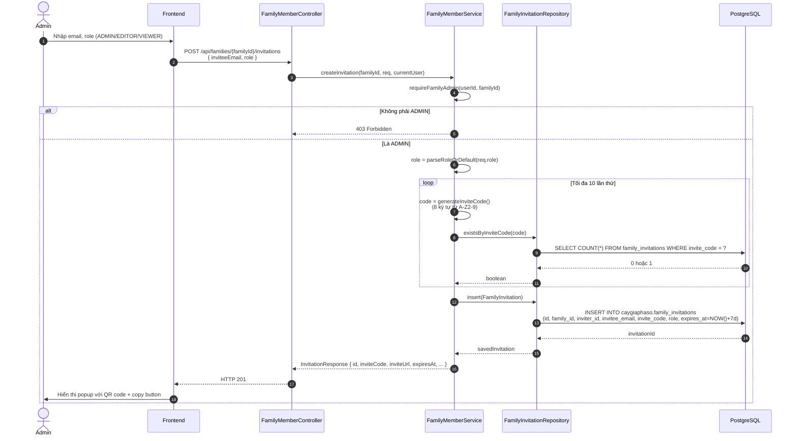
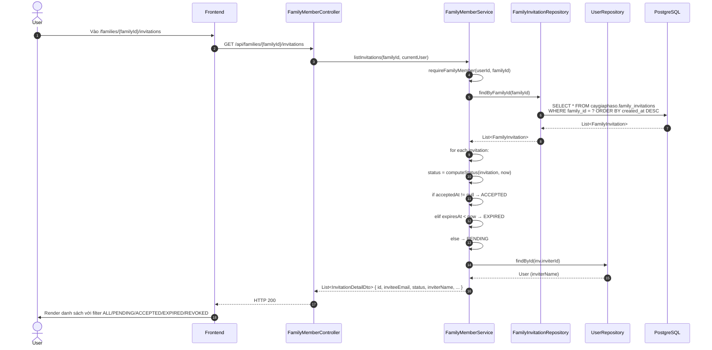
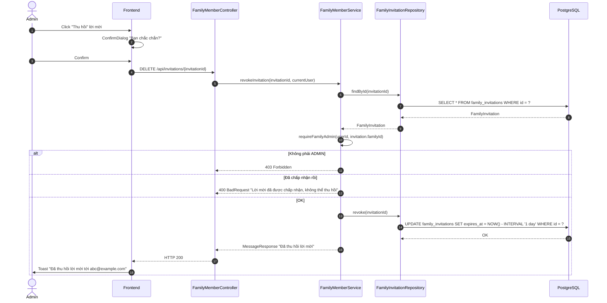
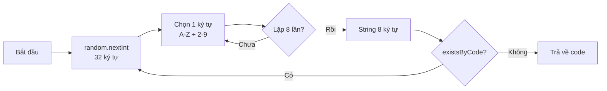

# Luồng 3: Lời mời vào Gia tộc (Invitations)

## Mô tả nghiệp vụ

Luồng quản lý lời mời cho phép:
- Tạo lời mời (mã 8 ký tự, có hạn 7 ngày)
- Xem lịch sử lời mời của gia tộc
- Thu hồi lời mời (revoke)
- Tự động vô hiệu hoá khi hết hạn

Mỗi lời mời gắn với 1 email cụ thể (tuỳ chọn) và 1 role (ADMIN/EDITOR/VIEWER). Mã mời được sinh ngẫu nhiên không trùng lặp.

## Sequence Diagram

### 3.1. Tạo lời mời



### 3.2. Xem lịch sử lời mời



### 3.3. Thu hồi lời mời (Revoke)



### 3.4. Sinh mã mời (chi tiết)



## API Endpoints liên quan

| Method | Path | Mô tả | Auth |
|--------|------|-------|------|
| `POST` | `/api/families/{familyId}/invitations` | Tạo lời mời (ADMIN) | ✅ |
| `GET` | `/api/families/{familyId}/invitations` | Lịch sử lời mời | ✅ |
| `DELETE` | `/api/invitations/{invitationId}` | Thu hồi (ADMIN) | ✅ |
| `POST` | `/api/families/join` | Tham gia bằng code | ✅ |

## Bảng DB liên quan

```sql
CREATE TABLE caygiaphaso.family_invitations (
    id              UUID PK DEFAULT gen_random_uuid(),
    family_id       UUID NOT NULL REFERENCES families(id) ON DELETE CASCADE,
    inviter_id      UUID NOT NULL REFERENCES users(id) ON DELETE CASCADE,
    invitee_email   TEXT NOT NULL,
    invite_code     TEXT NOT NULL UNIQUE,  -- 8 ký tự A-Z + 2-9
    role            TEXT NOT NULL CHECK (role IN ('ADMIN','EDITOR','VIEWER')),
    expires_at      TIMESTAMPTZ NOT NULL,  -- mặc định NOW() + 7 days
    accepted_at     TIMESTAMPTZ,
    created_at      TIMESTAMPTZ NOT NULL DEFAULT NOW()
);
```

## SQL mẫu để test

```sql
-- 1. Đếm lời mời theo trạng thái (PENDING/ACCEPTED/EXPIRED)
SELECT
    CASE
        WHEN accepted_at IS NOT NULL THEN 'ACCEPTED'
        WHEN expires_at < NOW() THEN 'EXPIRED'
        ELSE 'PENDING'
    END AS status,
    COUNT(*) AS total
FROM caygiaphaso.family_invitations
WHERE family_id = '...'
GROUP BY status
ORDER BY total DESC;

-- 2. Top admin đã mời nhiều nhất
SELECT u.email, u.full_name, COUNT(*) AS invitations_sent
FROM caygiaphaso.family_invitations fi
JOIN caygiaphaso.users u ON u.id = fi.inviter_id
WHERE fi.created_at > NOW() - INTERVAL '30 days'
GROUP BY u.id, u.email, u.full_name
ORDER BY invitations_sent DESC
LIMIT 10;

-- 3. Tỷ lệ chấp nhận lời mời (conversion rate)
SELECT
    COUNT(*) AS total_sent,
    COUNT(accepted_at) AS accepted,
    ROUND(100.0 * COUNT(accepted_at) / COUNT(*), 2) AS conversion_rate_pct
FROM caygiaphaso.family_invitations
WHERE created_at > NOW() - INTERVAL '90 days';

-- 4. Lời mời sắp hết hạn (cần nhắc nhở)
SELECT id, invitee_email, expires_at
FROM caygiaphaso.family_invitations
WHERE accepted_at IS NULL
  AND expires_at > NOW()
  AND expires_at < NOW() + INTERVAL '1 day'
ORDER BY expires_at ASC;

-- 5. Lời mời chưa dùng đã hết hạn (cleanup candidates)
DELETE FROM caygiaphaso.family_invitations
WHERE accepted_at IS NULL
  AND expires_at < NOW() - INTERVAL '30 days';

-- 6. Audit trail: ai đã mời ai và khi nào
SELECT
    inviter.email AS inviter,
    fi.invitee_email,
    fi.role,
    fi.created_at AS sent_at,
    fi.accepted_at AS accepted_at,
    CASE WHEN fi.expires_at < NOW() AND fi.accepted_at IS NULL
         THEN 'EXPIRED' ELSE 'OK' END AS status
FROM caygiaphaso.family_invitations fi
JOIN caygiaphaso.users inviter ON inviter.id = fi.inviter_id
ORDER BY fi.created_at DESC
LIMIT 50;
```

## Edge cases & luật phân quyền

1. **Mã mời unique**: Service retry tối đa 10 lần nếu collision (32^8 = ~1.1×10^12 combos → gần như không trùng).
2. **Email không khớp**: Khi `invitee_email` set, user đang join phải có email trùng (case-insensitive).
3. **Thu hồi**: Chỉ lời mời `PENDING` (chưa accept) mới revoke được.
4. **Expiration**: `expires_at < NOW()` được coi là EXPIRED, kể cả khi DB chưa update.
5. **Soft revoke**: Set `expires_at` về quá khứ thay vì DELETE row (giữ audit trail).
6. **Không có permission check**: Bất kỳ thành viên nào cũng xem được lịch sử lời mời.

## Test cases cho tester

### T1: Tạo lời mời thành công
```bash
ADMIN_TOKEN=$(...)
curl -X POST http://localhost:8080/api/families/{familyId}/invitations \
  -H "Authorization: Bearer $ADMIN_TOKEN" \
  -H "Content-Type: application/json" \
  -d '{"inviteeEmail":"newmember@example.com","role":"EDITOR"}'
```
Expected: HTTP 201, response chứa `inviteCode`, `inviteUrl`, `expiresAt`.

### T2: Tạo lời mời với role không hợp lệ
```bash
curl -X POST http://localhost:8080/api/families/{familyId}/invitations \
  -H "Authorization: Bearer $TOKEN" \
  -d '{"inviteeEmail":"x@y.com","role":"SUPERADMIN"}'
```
Expected: HTTP 400 (default về VIEWER).

### T3: Member không phải ADMIN tạo lời mời
```bash
# Token của EDITOR hoặc VIEWER
curl -X POST http://localhost:8080/api/families/{familyId}/invitations \
  -H "Authorization: Bearer $EDITOR_TOKEN" \
  -d '{"inviteeEmail":"x@y.com","role":"VIEWER"}'
```
Expected: HTTP 403.

### T4: Thu hồi lời mời đã accept
```bash
# Sau khi có user join thành công bằng code
curl -X DELETE http://localhost:8080/api/invitations/{invitationId} \
  -H "Authorization: Bearer $ADMIN_TOKEN"
```
Expected: HTTP 400 "Lời mời đã được chấp nhận, không thể thu hồi".

### T5: Verify QR code link
```bash
# Khi response trả về inviteUrl = "https://caygiaphaso.vn/join/ABC234XY"
# QR code từ frontend sẽ là:
# https://api.qrserver.com/v1/create-qr-code/?size=200x200&data=https://caygiaphaso.vn/join/ABC234XY
```

## Bài học SQL

1. **Random code generation**: Dùng SecureRandom với alphabet loại trừ 0/O/1/I/L để tránh nhầm lẫn.
2. **Invite code retry**: cần loop + check exists để tránh collision (alternative: UUID rút gọn).
3. **Status computation**: PENDING/ACCEPTED/EXPIRED tính on-the-fly từ `accepted_at` và `expires_at` — không cột `status`.
4. **Soft revoke**: Set `expires_at` về quá khứ thay vì DELETE → giữ audit trail cho việc review.
5. **Cleanup job**: nên có scheduled job xoá lời mời hết hạn > 30 ngày để giữ bảng nhỏ.
6. **Email validation**: chuẩn hoá lowercase trước khi lưu để dễ so sánh (`.trim().toLowerCase()`).