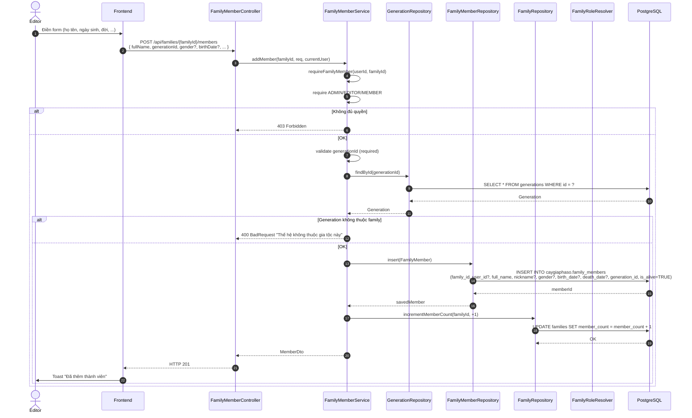
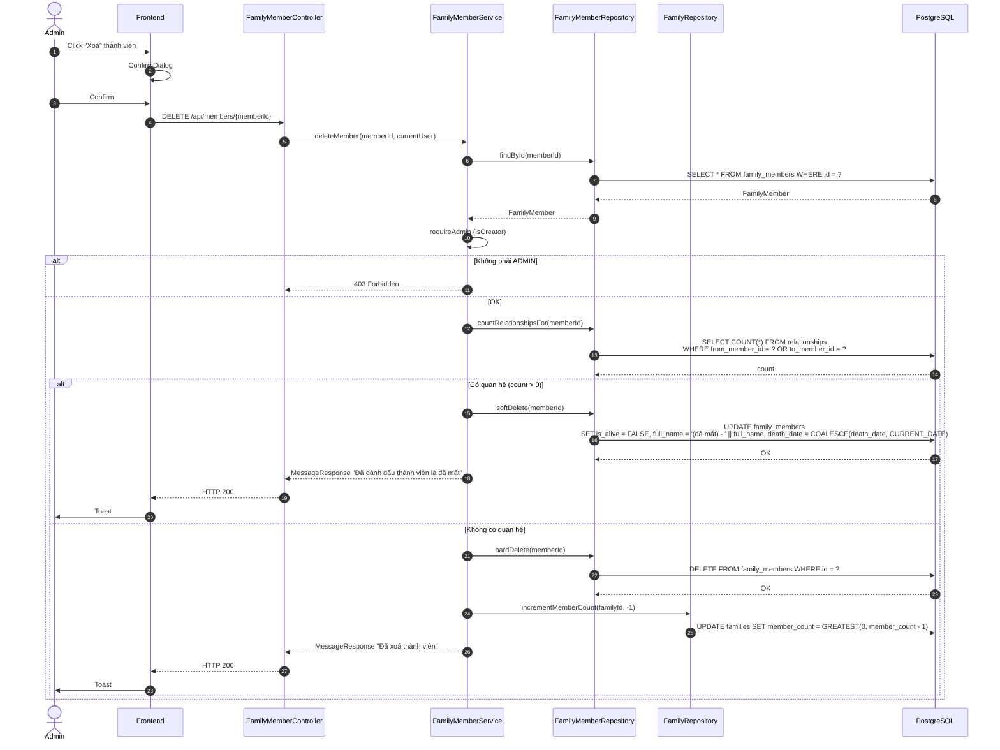
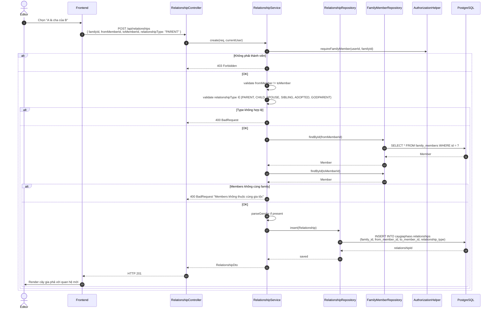
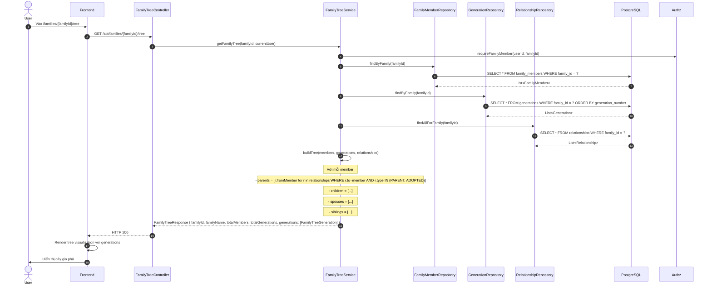
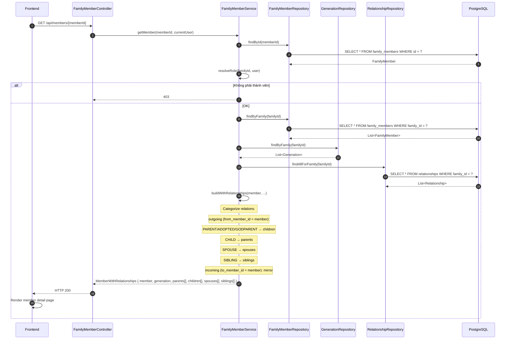

# Luồng 4: Thành viên & Quan hệ (Members & Relationships)

## Mô tả nghiệp vụ

Luồng quản lý thành viên và quan hệ trong cây gia phả:

- **Thành viên (FamilyMember)**:
  - Thêm thành viên (có thể có hoặc không liên kết với user account)
  - Sửa thông tin thành viên
  - Xoá thành viên (soft-delete nếu có quan hệ, hard-delete nếu cô đơn)
  - Tìm kiếm theo tên, lọc theo generation, aliveOnly

- **Quan hệ (Relationship)**:
  - Tạo quan hệ: PARENT/CHILD/SPOUSE/SIBLING/ADOPTED/GODPARENT
  - Sửa, xoá quan hệ
  - Trực quan hoá cây gia phả (recursive)

## Sequence Diagram

### 4.1. Thêm thành viên mới



### 4.2. Xoá thành viên



### 4.3. Tạo quan hệ (PARENT/CHILD)



### 4.4. Xem cây gia phả (Family Tree)



### 4.5. Lấy 1 thành viên kèm quan hệ



## API Endpoints liên quan

| Method | Path | Mô tả | Auth |
|--------|------|-------|------|
| `GET` | `/api/families/{familyId}/members` | List thành viên | ✅ |
| `GET` | `/api/members/{memberId}` | Chi tiết 1 thành viên | ✅ |
| `POST` | `/api/families/{familyId}/members` | Thêm thành viên (ADMIN/EDITOR) | ✅ |
| `PUT` | `/api/members/{memberId}` | Sửa thành viên | ✅ |
| `DELETE` | `/api/members/{memberId}` | Xoá (ADMIN) | ✅ |
| `GET` | `/api/families/{familyId}/tree` | Cây gia phả | ✅ |
| `POST` | `/api/relationships` | Tạo quan hệ | ✅ |
| `PUT` | `/api/relationships/{id}` | Sửa quan hệ | ✅ |
| `DELETE` | `/api/relationships/{id}` | Xoá quan hệ | ✅ |

## Bảng DB liên quan

```sql
-- family_members (đã có ở V1)
CREATE TABLE caygiaphaso.family_members (
    id UUID PK,
    family_id UUID FK -> families (CASCADE),
    user_id UUID FK -> users (SET NULL),
    full_name TEXT NOT NULL,
    nickname TEXT,
    gender TEXT CHECK (gender IN ('MALE', 'FEMALE', 'OTHER')),
    birth_date DATE,
    death_date DATE,
    birth_place TEXT,
    current_location TEXT,
    occupation TEXT,
    biography TEXT,
    generation_id UUID FK -> generations (SET NULL),
    is_alive BOOLEAN DEFAULT TRUE,
    -- ...
);

-- relationships (Edge semantics)
CREATE TABLE caygiaphaso.relationships (
    id UUID PK,
    family_id UUID FK -> families (CASCADE),
    from_member_id UUID FK -> family_members (CASCADE),
    to_member_id UUID FK -> family_members (CASCADE),
    relationship_type TEXT CHECK (IN ('PARENT','CHILD','SPOUSE','SIBLING','ADOPTED','GODPARENT')),
    start_date DATE,
    end_date DATE,
    notes TEXT,
    CHECK (from_member_id <> to_member_id)
);
```

## SQL mẫu để test

```sql
-- 1. Tìm kiếm thành viên theo tên
SELECT id, full_name, nickname, birth_date, is_alive
FROM caygiaphaso.family_members
WHERE family_id = '...'
  AND full_name ILIKE '%Nguyễn%'
ORDER BY birth_date NULLS LAST
LIMIT 20;

-- 2. Thành viên theo đời
SELECT
    g.generation_number,
    g.name AS generation_name,
    COUNT(*) AS member_count,
    COUNT(*) FILTER (WHERE m.is_alive = TRUE) AS alive_count,
    COUNT(*) FILTER (WHERE m.is_alive = FALSE) AS deceased_count
FROM caygiaphaso.generations g
LEFT JOIN caygiaphaso.family_members m ON m.generation_id = g.id
WHERE g.family_id = '...'
GROUP BY g.id, g.generation_number, g.name
ORDER BY g.generation_number;

-- 3. Các cặp quan hệ PARENT-CHILD trong gia tộc
SELECT
    p.full_name AS parent,
    c.full_name AS child,
    r.relationship_type,
    EXTRACT(YEAR FROM AGE(c.birth_date, p.birth_date)) AS age_gap_years
FROM caygiaphaso.relationships r
JOIN caygiaphaso.family_members p ON p.id = r.from_member_id
JOIN caygiaphaso.family_members c ON c.id = r.to_member_id
WHERE r.family_id = '...'
  AND r.relationship_type IN ('PARENT', 'CHILD')
ORDER BY age_gap_years;

-- 4. Couples (SPOUSE relationships)
SELECT
    a.full_name AS spouse_1,
    b.full_name AS spouse_2,
    r.start_date AS married_since
FROM caygiaphaso.relationships r
JOIN caygiaphaso.family_members a ON a.id = r.from_member_id
JOIN caygiaphaso.family_members b ON b.id = r.to_member_id
WHERE r.family_id = '...'
  AND r.relationship_type = 'SPOUSE';

-- 5. Tìm tổ tiên chung gần nhất của 2 người (recursive CTE)
WITH RECURSIVE ancestors_of_x AS (
    SELECT r.to_member_id AS ancestor_id, 1 AS depth
    FROM caygiaphaso.relationships r
    WHERE r.from_member_id = 'memberX' AND r.relationship_type IN ('PARENT','ADOPTED')
    UNION ALL
    SELECT r.to_member_id, a.depth + 1
    FROM caygiaphaso.relationships r
    JOIN ancestors_of_x a ON a.ancestor_id = r.from_member_id
    WHERE r.relationship_type IN ('PARENT','ADOPTED') AND a.depth < 10
)
SELECT m.full_name, MIN(a.depth) AS min_depth
FROM ancestors_of_x a
JOIN caygiaphaso.relationships r ON r.to_member_id = a.ancestor_id
JOIN caygiaphaso.family_members m ON m.id = r.to_member_id
WHERE r.from_member_id = 'memberY' AND r.relationship_type IN ('PARENT','ADOPTED')
GROUP BY m.id, m.full_name
ORDER BY min_depth ASC
LIMIT 5;

-- 6. Thành viên cô đơn (không có quan hệ nào)
SELECT m.*
FROM caygiaphaso.family_members m
WHERE m.family_id = '...'
  AND NOT EXISTS (
    SELECT 1 FROM caygiaphaso.relationships r
    WHERE r.from_member_id = m.id OR r.to_member_id = m.id
  );
```

## Edge cases & luật phân quyền

1. **Generation validation**: `generationId` phải thuộc cùng `familyId` (không cho dùng generation của gia tộc khác).
2. **Self-relationship**: CHECK constraint chặn `from_member_id = to_member_id`.
3. **Soft vs hard delete**:
   - Có quan hệ → soft delete (giữ lại row, set `is_alive = FALSE`)
   - Cô đơn → hard delete + decrement `families.member_count`
4. **Edge semantics**: `from → to` với type X nghĩa là "from là X của to":
   - `outgoing (self=from)`: PARENT → target=self's child, CHILD → target=self's parent
   - `incoming (self=to)`: ngược lại
5. **Authorization**: Thêm/sửa member cần ADMIN/EDITOR/MEMBER; xoá chỉ ADMIN (creator).

## Test cases cho tester

### T1: Thêm thành viên với generation sai
```bash
# generationId của gia tộc khác
curl -X POST http://localhost:8080/api/families/{familyId}/members \
  -H "Authorization: Bearer $TOKEN" \
  -d '{"fullName":"Test","generationId":"OTHER_FAMILY_GEN_ID"}'
```
Expected: HTTP 400 "Thế hệ không thuộc gia tộc này".

### T2: Tạo quan hệ self-loop
```bash
curl -X POST http://localhost:8080/api/relationships \
  -H "Authorization: Bearer $TOKEN" \
  -d '{"familyId":"...","fromMemberId":"SAME","toMemberId":"SAME","relationshipType":"PARENT"}'
```
Expected: HTTP 400 (CHECK constraint violation).

### T3: Verify tree shows all members
```bash
curl -X GET http://localhost:8080/api/families/{familyId}/tree \
  -H "Authorization: Bearer $TOKEN" | jq '.totalMembers'
```
Expected: Số thành viên thực tế.

### T4: Xoá thành viên có quan hệ (soft delete)
```bash
curl -X DELETE http://localhost:8080/api/members/{memberId} \
  -H "Authorization: Bearer $ADMIN_TOKEN"
```
Expected: HTTP 200, member.is_alive = FALSE trong DB, quan hệ vẫn còn.

### T5: Tìm tổ tiên
```sql
SELECT * FROM caygiaphaso.family_members
WHERE id IN (SELECT from_member_id FROM caygiaphaso.relationships WHERE to_member_id = 'X' AND relationship_type='PARENT');
```
Expected: Cha/mẹ của X.

## Bài học SQL

1. **Recursive CTE**: Pattern traversal cây gia phả (parent → child → grandchild).
2. **Bidirectional edges**: `relationships` là 1 chiều (`from → to`), cần mirror với type đảo (`PARENT` ↔ `CHILD`).
3. **Soft delete pattern**: Giữ row cho audit, set flag `is_alive` thay vì DELETE.
4. **Counter cache**: `families.member_count` được sync bằng trigger.
5. **Composite unique**: `UNIQUE (family_id, user_id)` partial index ngăn duplicate.
6. **Edge aggregation**: Aggregate nhiều relation về 4 buckets (parents/children/spouses/siblings).