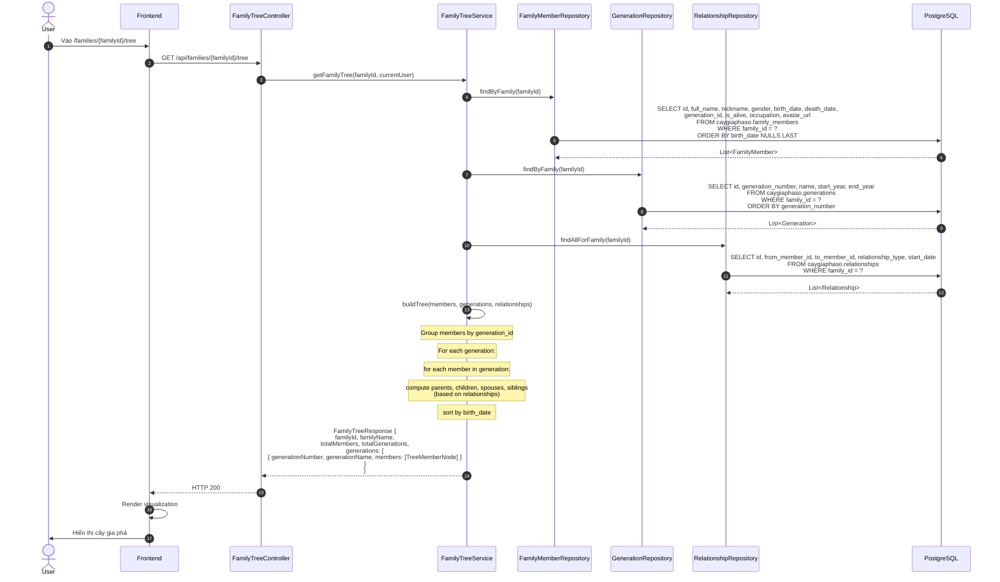
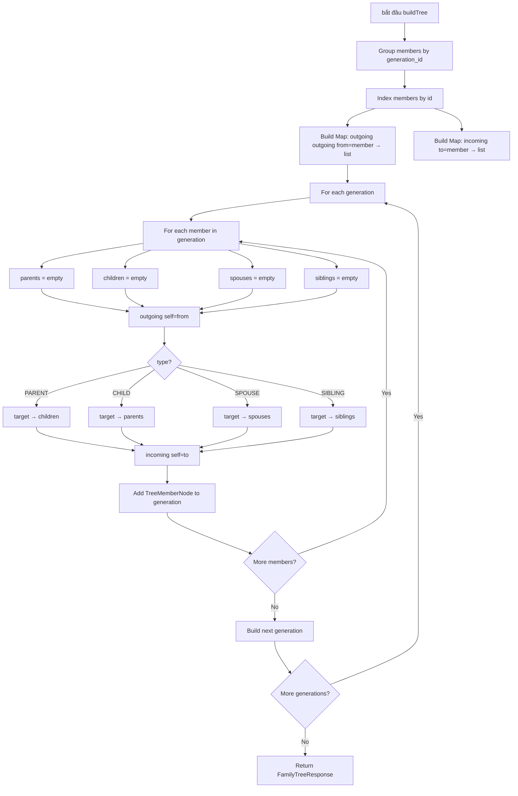
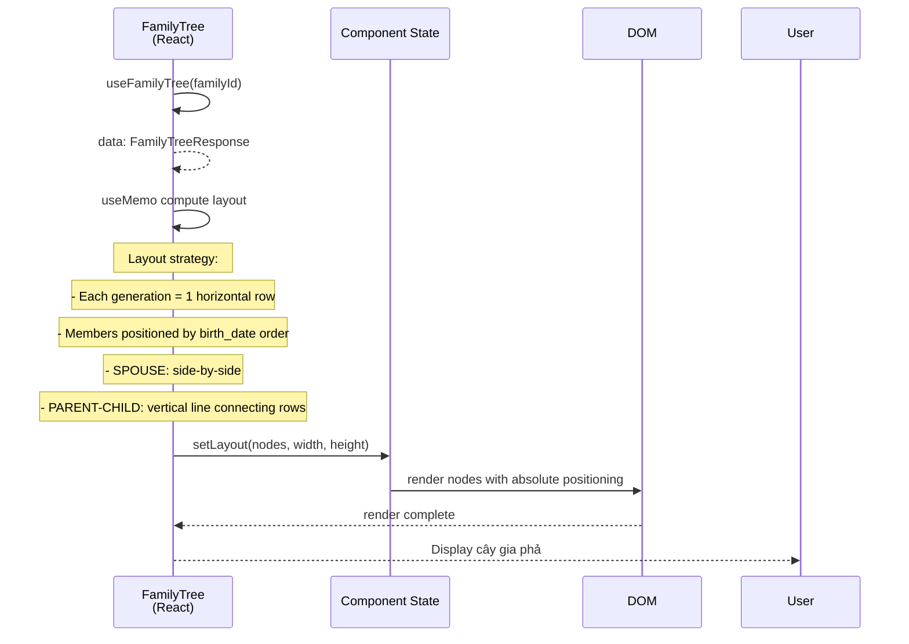

# Luồng 5: Cây gia phả trực quan (Family Tree Visualization)

## Mô tả nghiệp vụ

Luồng render cây gia phả trực quan cho user xem toàn bộ gia tộc theo đời (generation). Mỗi đời là 1 hàng ngang, các thành viên liên kết với nhau bằng quan hệ parent/child/spouse/sibling.

Tính năng:
- Phân nhóm theo generation (đời)
- Quan hệ cha-con (PARENT/CHILD)
- Quan hệ vợ-chồng (SPOUSE)
- Quan hệ anh-chị-em (SIBLING)
- Highlight member đang chọn
- Click vào member → trang chi tiết

## Sequence Diagram

### 5.1. Lấy dữ liệu cây gia phả



### 5.2. Logic buildTree (Backend)



### 5.3. Frontend Render



## API Endpoints liên quan

| Method | Path | Mô tả | Auth |
|--------|------|-------|------|
| `GET` | `/api/families/{familyId}/tree` | Lấy cây gia phả | ✅ |

## Bảng DB liên quan

- `family_members` - danh sách thành viên
- `generations` - thông tin các đời
- `relationships` - edges giữa các members

## SQL mẫu để test

```sql
-- 1. Lấy cây gia phả phẳng (cho debug)
SELECT
    g.generation_number AS gen,
    m.id AS member_id,
    m.full_name,
    m.gender,
    m.birth_date,
    m.is_alive,
    (
      SELECT COUNT(*) FROM caygiaphaso.relationships r
      WHERE r.to_member_id = m.id AND r.relationship_type IN ('PARENT','ADOPTED')
    ) AS parent_count,
    (
      SELECT COUNT(*) FROM caygiaphaso.relationships r
      WHERE r.from_member_id = m.id AND r.relationship_type IN ('PARENT','ADOPTED')
    ) AS child_count
FROM caygiaphaso.generations g
JOIN caygiaphaso.family_members m ON m.generation_id = g.id
WHERE g.family_id = '...'
ORDER BY g.generation_number, m.birth_date NULLS LAST;

-- 2. Số thành viên mỗi đời
SELECT g.generation_number, g.name, COUNT(m.id) AS total
FROM caygiaphaso.generations g
LEFT JOIN caygiaphaso.family_members m ON m.generation_id = g.id
WHERE g.family_id = '...'
GROUP BY g.id, g.generation_number, g.name
ORDER BY g.generation_number;

-- 3. Couples qua các đời
SELECT
    g1.generation_number AS gen_a,
    a.full_name AS spouse_a,
    g2.generation_number AS gen_b,
    b.full_name AS spouse_b,
    r.start_date
FROM caygiaphaso.relationships r
JOIN caygiaphaso.family_members a ON a.id = r.from_member_id
JOIN caygiaphaso.family_members b ON b.id = r.to_member_id
LEFT JOIN caygiaphaso.generations g1 ON g1.id = a.generation_id
LEFT JOIN caygiaphaso.generations g2 ON g2.id = b.generation_id
WHERE r.family_id = '...' AND r.relationship_type = 'SPOUSE'
ORDER BY r.start_date DESC NULLS LAST;

-- 4. Thành viên có nhiều con nhất (descendants count)
SELECT
    m.full_name,
    (
      WITH RECURSIVE descendants AS (
        SELECT to_member_id, 1 AS depth
        FROM caygiaphaso.relationships
        WHERE from_member_id = m.id AND relationship_type = 'PARENT'
        UNION ALL
        SELECT r.to_member_id, d.depth + 1
        FROM caygiaphaso.relationships r
        JOIN descendants d ON d.to_member_id = r.from_member_id
        WHERE r.relationship_type = 'PARENT' AND d.depth < 10
      )
      SELECT COUNT(*) FROM descendants
    ) AS descendant_count
FROM caygiaphaso.family_members m
WHERE m.family_id = '...'
ORDER BY descendant_count DESC
LIMIT 10;

-- 5. Thành viên cô đơn (không trong cây gia phả)
SELECT m.*
FROM caygiaphaso.family_members m
WHERE m.family_id = '...'
  AND NOT EXISTS (
    SELECT 1 FROM caygiaphaso.relationships r
    WHERE (r.from_member_id = m.id OR r.to_member_id = m.id)
  );

-- 6. Tất cả quan hệ cha-con (flat list)
SELECT
    p.full_name AS parent_name,
    p.gender AS parent_gender,
    c.full_name AS child_name,
    c.gender AS child_gender,
    EXTRACT(YEAR FROM AGE(COALESCE(c.birth_date, CURRENT_DATE), COALESCE(p.birth_date, CURRENT_DATE))) AS approx_age_gap
FROM caygiaphaso.relationships r
JOIN caygiaphaso.family_members p ON p.id = r.from_member_id
JOIN caygiaphaso.family_members c ON c.id = r.to_member_id
WHERE r.family_id = '...' AND r.relationship_type = 'PARENT'
ORDER BY p.birth_date NULLS LAST, c.birth_date NULLS LAST;
```

## Edge cases & luật phân quyền

1. **Member không có generation**: Hiển thị ở cuối cùng (generation null → bucket "Chưa rõ").
2. **Member không có quan hệ**: Hiển thị cô đơn, không có line kết nối.
3. **Member deceased**: Hiển thị với style mờ (grayscale, opacity 0.6).
4. **Spouse pair**: hiển thị side-by-side với line ngang nối.
5. **Cycle detection**: Không cho phép A→parent→B và B→parent→A (CHECK constraint `from != to`).
6. **Multiple generations missing**: Nếu generation_number có gap (1, 3, 5), frontend vẫn render theo thứ tự tăng dần.
7. **Empty family**: Trả về `generations: []`, `totalMembers: 0`.

## Test cases cho tester

### T1: Cây gia phả của gia tộc mới tạo (chỉ có creator)
```bash
curl -X GET http://localhost:8080/api/families/{newFamilyId}/tree \
  -H "Authorization: Bearer $TOKEN" | jq
```
Expected: 1 generation, 1 member.

### T2: Cây gia phả của gia tộc 5 đời (seed data)
```bash
# Sử dụng V2 seed data
psql -c "SELECT id FROM caygiaphaso.families LIMIT 1" 
curl -X GET http://localhost:8080/api/families/{seedFamilyId}/tree \
  -H "Authorization: Bearer $TOKEN" | jq '.totalGenerations, .totalMembers'
```
Expected: totalGenerations=5, totalMembers ~ 20+.

### T3: Render visual layout
```bash
# Verify members sorted by birth_date within each generation
psql -c "SELECT full_name, birth_date FROM caygiaphaso.family_members WHERE family_id='...' AND generation_id=(SELECT id FROM generations WHERE generation_number=1 LIMIT 1) ORDER BY birth_date NULLS LAST"
```

### T4: Tree consistency check
```sql
-- Mỗi PARENT relationship phải có from.generation > to.generation
-- (Parent sinh con → đời cha cao hơn)
SELECT r.*
FROM caygiaphaso.relationships r
JOIN caygiaphaso.family_members p ON p.id = r.from_member_id
JOIN caygiaphaso.family_members c ON c.id = r.to_member_id
JOIN caygiaphaso.generations pg ON pg.id = p.generation_id
JOIN caygiaphaso.generations cg ON cg.id = c.generation_id
WHERE r.relationship_type = 'PARENT'
  AND pg.generation_number <= cg.generation_number;
```
Expected: 0 rows (data inconsistency).

## Bài học SQL

1. **Recursive CTE**: Traversal cây (descendant count, ancestor chain).
2. **WITH RECURSIVE**: Cú pháp PostgreSQL cho recursive query với UNION ALL.
3. **EXTRACT(YEAR FROM AGE(...))**: Tính tuổi/khoảng cách giữa 2 dates.
4. **LEFT JOIN**: Lấy thành viên kể cả khi không có generation (generation_id NULL).
5. **NULLS LAST**: Sắp xếp thành viên không có ngày sinh xuống cuối.
6. **Composite index**: `(family_id, birth_date)` cho phép query sorted theo birth_date trong 1 family nhanh.
7. **Tree depth limit**: Recursive CTE cần `AND depth < N` để tránh infinite loop (cycle).
8. **COUNT subquery vs COUNT window**: Performance khác nhau tuỳ use case.