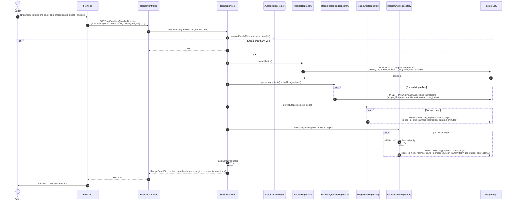
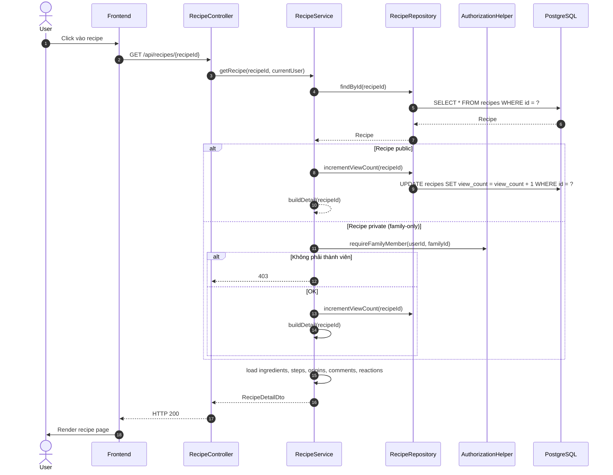
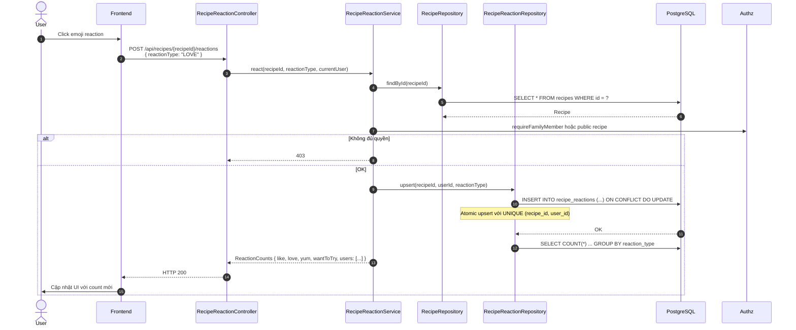
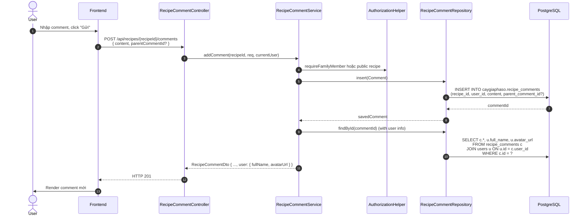

# Luồng 6: Công thức nấu ăn (Recipes)

## Mô tả nghiệp vụ

Luồng quản lý công thức nấu ăn (recipe) trong gia tộc:
- Tạo / sửa / xoá công thức
- Mỗi recipe có: ingredients (nguyên liệu), steps (các bước), origins (lai lịch truyền lại - xem Recipe Genealogy)
- Tìm kiếm công thức công khai (public recipes)
- Reactions (LIKE / LOVE / YUM / WANT_TO_TRY)
- Comments (có thể reply)

## Sequence Diagram

### 6.1. Tạo công thức mới



### 6.2. Lấy chi tiết công thức



### 6.3. Thêm reaction



### 6.4. Thêm comment



## API Endpoints liên quan

| Method | Path | Mô tả | Auth |
|--------|------|-------|------|
| `GET` | `/api/families/{familyId}/recipes` | List recipes của family | ✅ |
| `GET` | `/api/recipes/public` | Tìm kiếm công khai | ❌ |
| `GET` | `/api/recipes/{id}` | Chi tiết | ✅ (public: ❌) |
| `POST` | `/api/families/{familyId}/recipes` | Tạo (member) | ✅ |
| `PUT` | `/api/recipes/{id}` | Sửa (author/admin) | ✅ |
| `DELETE` | `/api/recipes/{id}` | Xoá (author/admin) | ✅ |
| `POST` | `/api/recipes/{id}/reactions` | Reaction | ✅ |
| `DELETE` | `/api/recipes/{id}/reactions` | Bỏ reaction | ✅ |
| `GET` | `/api/recipes/{id}/reactions` | List reactions | ✅ |
| `POST` | `/api/recipes/{id}/comments` | Comment | ✅ |
| `GET` | `/api/recipes/{id}/comments` | List comments | ✅ |
| `PUT` | `/api/comments/{commentId}` | Sửa comment | ✅ |
| `DELETE` | `/api/comments/{commentId}` | Xoá comment | ✅ |

## Bảng DB liên quan

```sql
CREATE TABLE caygiaphaso.recipes (
    id UUID PK,
    family_id UUID FK -> families,
    author_id UUID FK -> users,
    title TEXT,
    description TEXT,
    story TEXT,  -- câu chuyện gia đình
    cuisine_type TEXT,
    difficulty TEXT CHECK (IN ('EASY','MEDIUM','HARD')),
    prep_time_minutes INTEGER,
    cook_time_minutes INTEGER,
    servings INTEGER,
    instructions TEXT,  -- tóm tắt method
    image_url TEXT,
    is_public BOOLEAN,
    view_count INTEGER DEFAULT 0
);

CREATE TABLE caygiaphaso.recipe_ingredients (
    id UUID PK,
    recipe_id UUID FK -> recipes (CASCADE),
    name TEXT,
    quantity NUMERIC(10,2),
    unit TEXT,
    notes TEXT,
    order_index INTEGER
);

CREATE TABLE caygiaphaso.recipe_steps (
    id UUID PK,
    recipe_id UUID FK,
    step_number INTEGER UNIQUE per recipe,
    instruction TEXT,
    duration_minutes INTEGER,
    image_url TEXT
);

CREATE TABLE caygiaphaso.recipe_reactions (
    id UUID PK,
    recipe_id UUID FK,
    user_id UUID FK -> users (CASCADE),
    reaction_type TEXT CHECK (IN ('LIKE','LOVE','YUM','WANT_TO_TRY')),
    UNIQUE (recipe_id, user_id)  -- tightened by V4
);

CREATE TABLE caygiaphaso.recipe_comments (
    id UUID PK,
    recipe_id UUID FK,
    user_id UUID FK,
    content TEXT,
    parent_comment_id UUID FK -> recipe_comments (SET NULL),
    created_at, updated_at
);
```

## SQL mẫu để test

```sql
-- 1. Top 10 công thức được xem nhiều nhất
SELECT id, title, view_count, cuisine_type
FROM caygiaphaso.recipes
ORDER BY view_count DESC
LIMIT 10;

-- 2. Công thức được reaction nhiều nhất
SELECT r.id, r.title,
       COUNT(DISTINCT rr.id) AS reaction_count,
       COUNT(DISTINCT rc.id) AS comment_count
FROM caygiaphaso.recipes r
LEFT JOIN caygiaphaso.recipe_reactions rr ON rr.recipe_id = r.id
LEFT JOIN caygiaphaso.recipe_comments rc ON rc.recipe_id = r.id
GROUP BY r.id, r.title
ORDER BY reaction_count DESC
LIMIT 10;

-- 3. Tổng số reactions theo từng loại cho 1 recipe
SELECT reaction_type, COUNT(*) AS count
FROM caygiaphaso.recipe_reactions
WHERE recipe_id = '...'
GROUP BY reaction_type
ORDER BY count DESC;

-- 4. Công thức chưa có ảnh
SELECT id, title, cuisine_type, difficulty
FROM caygiaphaso.recipes
WHERE image_url IS NULL
  AND created_at > NOW() - INTERVAL '30 days'
ORDER BY created_at DESC;

-- 5. Comment threads (cha + replies)
SELECT
    c.id AS root_id,
    c.content AS root_content,
    u.full_name AS root_author,
    (SELECT COUNT(*) FROM caygiaphaso.recipe_comments r WHERE r.parent_comment_id = c.id) AS reply_count
FROM caygiaphaso.recipe_comments c
JOIN caygiaphaso.users u ON u.id = c.user_id
WHERE c.recipe_id = '...' AND c.parent_comment_id IS NULL
ORDER BY c.created_at DESC;

-- 6. Thời gian nấu trung bình theo cuisine
SELECT
    cuisine_type,
    AVG(prep_time_minutes + cook_time_minutes) AS avg_total_minutes,
    COUNT(*) AS recipe_count
FROM caygiaphaso.recipes
WHERE cuisine_type IS NOT NULL
  AND prep_time_minutes IS NOT NULL
  AND cook_time_minutes IS NOT NULL
GROUP BY cuisine_type
ORDER BY avg_total_minutes DESC;

-- 7. User activity: ai comment nhiều nhất
SELECT
    u.email,
    u.full_name,
    COUNT(*) AS comments_posted,
    COUNT(DISTINCT c.recipe_id) AS unique_recipes
FROM caygiaphaso.recipe_comments c
JOIN caygiaphaso.users u ON u.id = c.user_id
WHERE c.created_at > NOW() - INTERVAL '30 days'
GROUP BY u.id, u.email, u.full_name
ORDER BY comments_posted DESC
LIMIT 10;
```

## Edge cases & luật phân quyền

1. **Public vs Private recipe**: Public xem được bởi ai cũng (kể cả không đăng nhập), private chỉ thành viên family.
2. **Reaction unique**: Mỗi user chỉ có 1 reaction per recipe (UPSERT). Đổi loại reaction → cập nhật.
3. **Comment threading**: `parent_comment_id` cho phép reply (1 cấp hoặc đa cấp tuỳ frontend).
4. **Soft delete comment**: Cập nhật `content = '[deleted]'` và `updated_at` (giữ audit).
5. **Author chỉnh sửa**: Chỉ author hoặc ADMIN family mới sửa/xoá recipe.
6. **View count**: Tăng sau mỗi lượt GET (ngoại trừ author xem).

## Test cases cho tester

### T1: Tạo recipe thành công
```bash
curl -X POST http://localhost:8080/api/families/{familyId}/recipes \
  -H "Authorization: Bearer $TOKEN" \
  -H "Content-Type: application/json" \
  -d '{
    "title": "Phở bò gia truyền",
    "description": "Phở bò Hà Nội truyền thống",
    "cuisineType": "Việt Nam",
    "difficulty": "MEDIUM",
    "prepTimeMinutes": 30,
    "cookTimeMinutes": 180,
    "servings": 4,
    "instructions": "Hầm xương bò 3 tiếng, nêm nếm gia vị truyền thống",
    "ingredients": [
      {"name": "Xương bò", "quantity": 2, "unit": "kg"},
      {"name": "Bánh phở", "quantity": 500, "unit": "g"}
    ],
    "steps": [
      {"stepNumber": 1, "instruction": "Rửa xương, chần sôi 5 phút", "durationMinutes": 5},
      {"stepNumber": 2, "instruction": "Hầm xương với gừng, hành", "durationMinutes": 180}
    ],
    "origins": [
      {"fromMemberId": "...", "toMemberId": "...", "yearTransmitted": 1950, "story": "Ông cố truyền lại"}
    ]
  }'
```
Expected: HTTP 201, response đầy đủ RecipeDetailDto.

### T2: Public recipe search
```bash
# Không cần token
curl -X GET "http://localhost:8080/api/recipes/public?cuisine=Việt%20Nam&sort=popular"
```
Expected: HTTP 200, list recipes có `is_public = TRUE`.

### T3: Reaction toggle
```bash
# Thêm reaction
curl -X POST http://localhost:8080/api/recipes/{recipeId}/reactions \
  -H "Authorization: Bearer $TOKEN" \
  -d '{"reactionType":"LOVE"}'
# Đổi sang YUM
curl -X POST http://localhost:8080/api/recipes/{recipeId}/reactions \
  -H "Authorization: Bearer $TOKEN" \
  -d '{"reactionType":"YUM"}'
# Verify: chỉ 1 reaction per user
```
Expected: Sau 2 calls, chỉ YUM count tăng, LOVE count giữ nguyên.

### T4: Comment thread
```bash
# Comment cha
PARENT=$(curl -X POST http://localhost:8080/api/recipes/{recipeId}/comments \
  -H "Authorization: Bearer $TOKEN" \
  -d '{"content":"Công thức hay!"}' | jq -r '.comment.id')

# Reply
curl -X POST http://localhost:8080/api/recipes/{recipeId}/comments \
  -H "Authorization: Bearer $TOKEN" \
  -d "{\"content\":\"Cảm ơn!\",\"parentCommentId\":\"$PARENT\"}"
```
Expected: 2 comments, reply có parentCommentId = parent.id.

## Bài học SQL

1. **Atomic UPSERT**: `INSERT ... ON CONFLICT DO UPDATE` cho reactions tránh race condition.
2. **Tightened unique constraint**: V4 đổi `UNIQUE (recipe_id, user_id, reaction_type)` → `UNIQUE (recipe_id, user_id)` để enforce "1 reaction per user per recipe".
3. **Counter cache**: `view_count` được UPDATE async (không cần RETURNING vì response không cần giá trị mới).
4. **Polymorphic counts**: Aggregate reactions/comments theo từng recipe dùng LEFT JOIN + GROUP BY.
5. **Soft delete pattern**: Comment xoá bằng cách update `content` thay vì DELETE (giữ thread integrity).
6. **Cascade delete**: `recipe_ingredients`, `recipe_steps`, `recipe_reactions`, `recipe_comments` đều CASCADE khi xoá recipe.
7. **Check constraints**: `difficulty IN ('EASY','MEDIUM','HARD')` enforce ở DB layer.