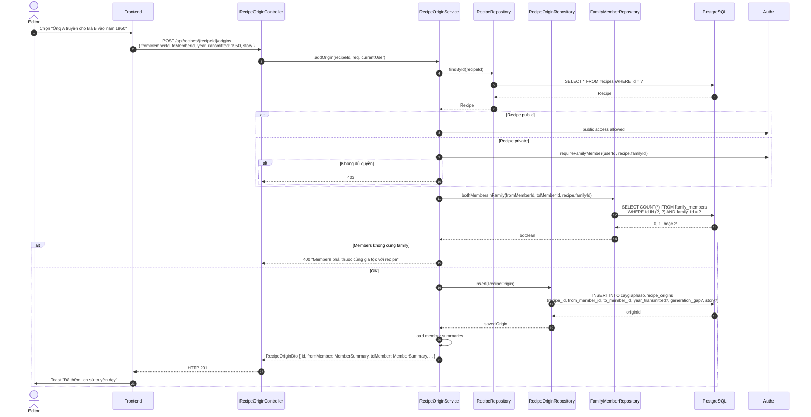
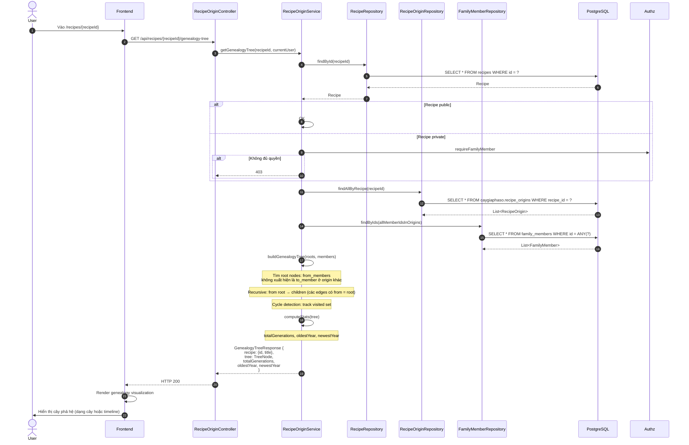
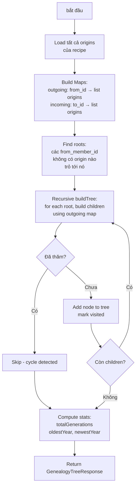
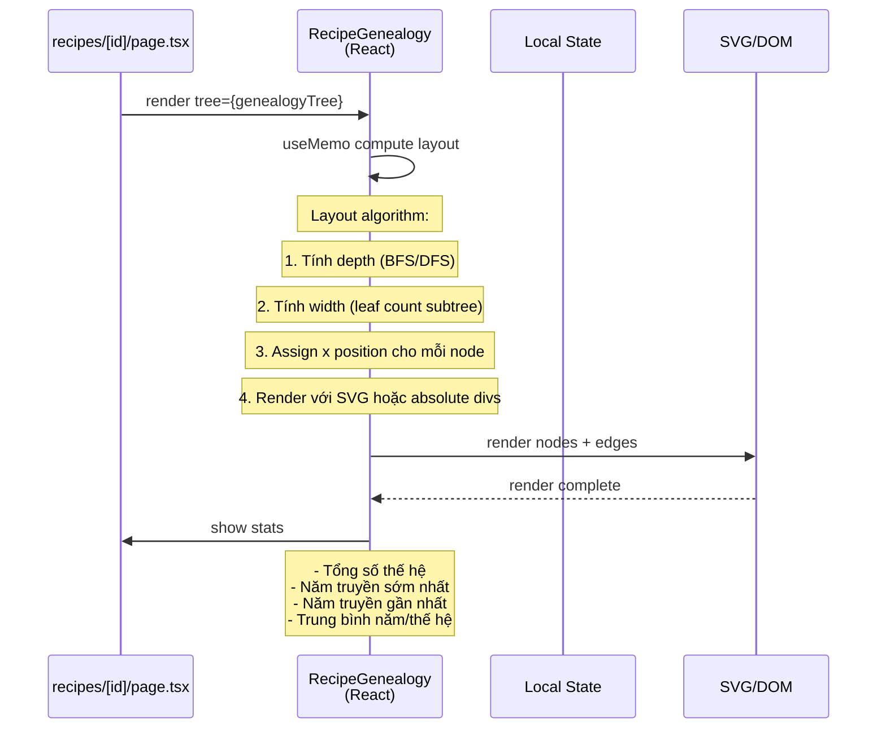

# Luồng 7: Phả hệ Công thức (Recipe Genealogy)

## Mô tả nghiệp vụ

**Tính năng độc đáo #1 của CâyGiaPhảSố**: Truy nguyên nguồn gốc công thức qua các thế hệ.

Mỗi recipe có thể có nhiều "origin edges" (cạnh truyền dạy), mỗi edge biểu thị:
- `fromMemberId`: thành viên truyền công thức
- `toMemberId`: thành viên được truyền
- `yearTransmitted`: năm truyền (optional)
- `generationGap`: khoảng cách thế hệ (optional)
- `story`: câu chuyện truyền dạy (optional)

API cung cấp:
- `GET /api/recipes/{id}/origins` - flat list
- `POST /api/recipes/{id}/origins` - thêm edge
- `GET /api/recipes/{id}/genealogy-tree` - **cây phả hệ đầy đủ** (recursive)

## Sequence Diagram

### 7.1. Thêm origin edge



### 7.2. Lấy cây phả hệ đầy đủ (Genealogy Tree)



### 7.3. Logic buildGenealogyTree (chi tiết)



### 7.4. Frontend Visualization (RecipeGenealogy component)



## API Endpoints liên quan

| Method | Path | Mô tả | Auth |
|--------|------|-------|------|
| `GET` | `/api/recipes/{id}/origins` | Flat list | ✅ |
| `POST` | `/api/recipes/{id}/origins` | Thêm edge | ✅ |
| `GET` | `/api/recipes/{id}/genealogy-tree` | Cây phả hệ | ✅ |
| `GET` | `/api/recipes/{id}` | Recipe (include origins) | ✅ |

## Bảng DB liên quan

```sql
CREATE TABLE caygiaphaso.recipe_origins (
    id UUID PK,
    recipe_id UUID FK -> recipes (CASCADE),
    from_member_id UUID FK -> family_members (CASCADE),
    to_member_id UUID FK -> family_members (CASCADE),
    year_transmitted INTEGER,
    generation_gap INTEGER CHECK (>= 0),
    story TEXT,
    created_at TIMESTAMPTZ,
    CHECK (from_member_id <> to_member_id)
);
```

## SQL nâng cao - Recipe Genealogy

### 1. Tìm cây phả hệ bằng Recursive CTE

```sql
-- Tìm tất cả ancestors của một người (trong recipe context)
WITH RECURSIVE ancestors AS (
    SELECT
        ro.id AS origin_id,
        ro.from_member_id,
        ro.to_member_id,
        ro.year_transmitted,
        ro.story,
        1 AS depth,
        ARRAY[ro.from_member_id] AS path  -- cycle detection
    FROM caygiaphaso.recipe_origins ro
    WHERE ro.recipe_id = '...' AND ro.to_member_id = 'MEMBER_X'

    UNION ALL

    SELECT
        ro.id,
        ro.from_member_id,
        ro.to_member_id,
        ro.year_transmitted,
        ro.story,
        a.depth + 1,
        a.path || ro.from_member_id
    FROM caygiaphaso.recipe_origins ro
    JOIN ancestors a ON a.from_member_id = ro.to_member_id
    WHERE ro.recipe_id = '...'
      AND NOT (ro.from_member_id = ANY(a.path))  -- cycle guard
      AND a.depth < 20  -- max depth
)
SELECT
    a.depth,
    fm.full_name AS ancestor_name,
    fm.birth_date,
    a.year_transmitted,
    a.story
FROM ancestors a
JOIN caygiaphaso.family_members fm ON fm.id = a.from_member_id
ORDER BY a.depth;
```

### 2. Thống kê recipe genealogy

```sql
-- Recipe nào có nhiều generations nhất
SELECT
    r.id,
    r.title,
    COUNT(DISTINCT ro.from_member_id) + COUNT(DISTINCT ro.to_member_id) AS unique_members,
    MIN(ro.year_transmitted) AS oldest_year,
    MAX(ro.year_transmitted) AS newest_year,
    EXTRACT(YEAR FROM AGE(MAX(ro.year_transmitted), MIN(ro.year_transmitted))) AS years_span
FROM caygiaphaso.recipes r
JOIN caygiaphaso.recipe_origins ro ON ro.recipe_id = r.id
GROUP BY r.id, r.title
ORDER BY years_span DESC NULLS LAST
LIMIT 10;
```

### 3. Recipe "nổi tiếng" - nhiều origins

```sql
SELECT
    r.id,
    r.title,
    COUNT(ro.id) AS origin_count,
    COUNT(DISTINCT ro.from_member_id) AS unique_originators,
    COUNT(DISTINCT ro.to_member_id) AS unique_recipients
FROM caygiaphaso.recipes r
LEFT JOIN caygiaphaso.recipe_origins ro ON ro.recipe_id = r.id
GROUP BY r.id, r.title
HAVING COUNT(ro.id) > 0
ORDER BY origin_count DESC;
```

### 4. Person với nhiều recipes nhất (matriarch/patriarch trong gia tộc)

```sql
SELECT
    m.full_name,
    m.gender,
    COUNT(DISTINCT ro.recipe_id) AS recipes_passed,
    COUNT(DISTINCT ro.id) AS transmissions
FROM caygiaphaso.family_members m
JOIN caygiaphaso.recipe_origins ro
  ON (ro.from_member_id = m.id OR ro.to_member_id = m.id)
WHERE m.family_id = '...'
GROUP BY m.id, m.full_name, m.gender
ORDER BY transmissions DESC
LIMIT 10;
```

### 5. Tìm "người gốc" (root originator) cho mỗi recipe

```sql
-- Recipe X: ai là người đầu tiên tạo ra / truyền dạy?
SELECT DISTINCT
    ro.recipe_id,
    r.title,
    fm.full_name AS root_originator,
    fm.birth_date,
    g.generation_number
FROM caygiaphaso.recipe_origins ro
JOIN caygiaphaso.recipes r ON r.id = ro.recipe_id
JOIN caygiaphaso.family_members fm ON fm.id = ro.from_member_id
LEFT JOIN caygiaphaso.generations g ON g.id = fm.generation_id
WHERE NOT EXISTS (
    -- Đảm bảo không có origin nào trỏ tới from_member_id này
    SELECT 1 FROM caygiaphaso.recipe_origins ro2
    WHERE ro2.recipe_id = ro.recipe_id
      AND ro2.to_member_id = ro.from_member_id
);
```

### 6. Tất cả paths từ root đến leaves (recipe lineage)

```sql
WITH RECURSIVE lineage AS (
    -- Root nodes
    SELECT
        ro.recipe_id,
        ro.from_member_id AS current_id,
        ro.to_member_id AS next_id,
        ARRAY[ro.from_member_id] AS path,
        1 AS generation
    FROM caygiaphaso.recipe_origins ro
    WHERE ro.recipe_id = '...' AND NOT EXISTS (
        SELECT 1 FROM caygiaphaso.recipe_origins ro2
        WHERE ro2.recipe_id = ro.recipe_id AND ro2.to_member_id = ro.from_member_id
    )

    UNION ALL

    SELECT
        l.recipe_id,
        l.next_id,
        ro.to_member_id,
        l.path || l.next_id,
        l.generation + 1
    FROM lineage l
    JOIN caygiaphaso.recipe_origins ro ON ro.recipe_id = l.recipe_id AND ro.from_member_id = l.next_id
    WHERE NOT (l.next_id = ANY(l.path))
      AND l.generation < 10
)
SELECT
    generation,
    current_id,
    fm.full_name,
    path
FROM lineage l
JOIN caygiaphaso.family_members fm ON fm.id = l.current_id
WHERE NOT EXISTS (
    -- Leaves: không có edge outgoing từ current_id
    SELECT 1 FROM caygiaphaso.recipe_origins ro
    WHERE ro.recipe_id = l.recipe_id AND ro.from_member_id = l.next_id
)
ORDER BY generation;
```

## Edge cases & luật phân quyền

1. **Cùng family**: `from_member` và `to_member` phải thuộc cùng `recipe.family_id`.
2. **Cycle prevention**: Phát hiện vòng lặp bằng `path` array trong recursive CTE.
3. **Public recipe**: Ai cũng xem được genealogy tree (kể cả không đăng nhập).
4. **Multiple roots**: 1 recipe có thể có nhiều roots (nhiều người "sáng tạo" độc lập).
5. **Orphan nodes**: Member không trong origin nào → không hiển thị trong tree.
6. **Same person**: 1 người có thể vừa là from vừa là to ở 2 edges khác nhau (linear chain).
7. **Year validation**: `year_transmitted` optional, có thể NULL nếu không nhớ rõ.

## Test cases cho tester

### T1: Tạo recipe genealogy đơn giản (3 generations)
```bash
# Tạo recipe
RECIPE=$(curl -X POST .../recipes -d '{...}' | jq -r '.recipe.id')

# Tạo 3 edges: A→B→C
curl -X POST ".../recipes/$RECIPE/origins" -d '{
  "fromMemberId": "A", "toMemberId": "B", "yearTransmitted": 1950, "story": "..."
}'
curl -X POST ".../recipes/$RECIPE/origins" -d '{
  "fromMemberId": "B", "toMemberId": "C", "yearTransmitted": 1980
}'

# Lấy genealogy tree
curl -X GET ".../recipes/$RECIPE/genealogy-tree"
```
Expected: tree có root A → B → C, totalGenerations=3.

### T2: Recipe có 2 cây độc lập (2 origins)
```bash
# A→B, D→E (2 chains riêng)
curl ... (4 origins calls)

curl -X GET ".../recipes/$RECIPE/genealogy-tree"
```
Expected: 2 root nodes (A và D), mỗi chain 2 generations.

### T3: Cycle detection
```bash
# A→B, B→A (cycle)
curl -X POST ".../recipes/$RECIPE/origins" -d '{"fromMemberId":"A","toMemberId":"B"}'
curl -X POST ".../recipes/$RECIPE/origins" -d '{"fromMemberId":"B","toMemberId":"A"}'

curl -X GET ".../recipes/$RECIPE/genealogy-tree"
```
Expected: Backend cycle guard chặn, tree chỉ có 1 root hoặc error.

### T4: Members khác family
```bash
# Recipe thuộc family A, member thuộc family B
curl -X POST ".../recipes/$FAMILY_A_RECIPE/origins" -d '{
  "fromMemberId": "MEMBER_IN_FAMILY_B",
  "toMemberId": "MEMBER_IN_FAMILY_A"
}'
```
Expected: HTTP 400.

## Bài học SQL

1. **Recursive CTE với cycle detection**: Dùng `ARRAY[...]` để track path, `NOT (x = ANY(path))` chặn cycle.
2. **Max depth guard**: Luôn `AND depth < N` để tránh infinite loop.
3. **Multiple roots**: Graph không nhất thiết là tree - có thể có nhiều disconnected components.
4. **Topological sort**: Để render đúng thứ tự generation, có thể cần DFS/BFS hoặc sắp xếp theo depth.
5. **JSON path tracking**: Dùng `array_agg(member_id ORDER BY depth)` để output genealogy path cho frontend.
6. **Window functions**: `ROW_NUMBER() OVER (PARTITION BY recipe_id ORDER BY year_transmitted)` để rank origins.
7. **EXTRACT + AGE**: Tính years span giữa oldest và newest transmission.
8. **Edge semantics**: Origin `from→to` nghĩa là "from truyền cho to" - một chiều, cần mirror nếu muốn 2 chiều.