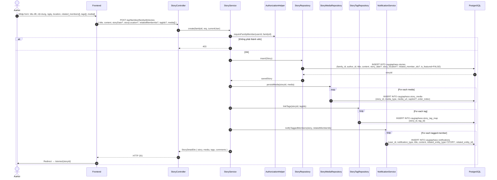
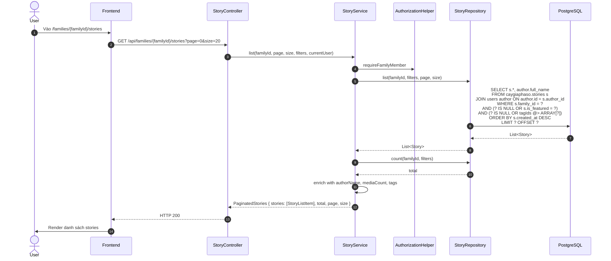

# Luồng 8: Câu chuyện gia tộc (Stories)

## Mô tả nghiệp vụ

Luồng quản lý câu chuyện trong gia tộc:
- Tạo / sửa / xoá story
- Mỗi story có: title, content, story_date, story_location, related_member_ids
- Media: image/video/audio/document
- Tags: tag hệ thống (story_tags)
- Comments trên story

## Sequence Diagram

### 8.1. Tạo story mới



### 8.2. Lấy danh sách stories



## API Endpoints liên quan

| Method | Path | Mô tả | Auth |
|--------|------|-------|------|
| `GET` | `/api/families/{familyId}/stories` | List | ✅ |
| `GET` | `/api/stories/{id}` | Detail | ✅ |
| `POST` | `/api/families/{familyId}/stories` | Tạo | ✅ |
| `PUT` | `/api/stories/{id}` | Sửa | ✅ |
| `DELETE` | `/api/stories/{id}` | Xoá | ✅ |
| `GET` | `/api/story-tags` | List tags | ✅ |
| `POST` | `/api/story-tags` | Tạo tag | ✅ |

## Bảng DB liên quan

```sql
CREATE TABLE caygiaphaso.stories (
    id UUID PK,
    family_id UUID FK -> families (CASCADE),
    author_id UUID FK -> users (RESTRICT),
    title TEXT,
    content TEXT,
    story_date DATE,
    story_location TEXT,
    related_member_ids UUID[],  -- array of FamilyMember IDs
    related_generation_id UUID FK -> generations (SET NULL),
    is_featured BOOLEAN,
    view_count INTEGER DEFAULT 0
);

CREATE TABLE caygiaphaso.story_media (
    id UUID PK,
    story_id UUID FK -> stories (CASCADE),
    media_type TEXT CHECK (IN ('IMAGE','VIDEO','AUDIO','DOCUMENT')),
    media_url TEXT,
    caption TEXT,
    order_index INTEGER
);

CREATE TABLE caygiaphaso.story_tags (
    id UUID PK,
    name TEXT UNIQUE  -- V4: case-insensitive unique via functional index
);

CREATE TABLE caygiaphaso.story_tag_map (
    story_id UUID FK,
    tag_id UUID FK,
    PRIMARY KEY (story_id, tag_id)
);
```

## SQL mẫu

```sql
-- 1. Top stories by view count
SELECT id, title, view_count, created_at
FROM caygiaphaso.stories
WHERE family_id = '...'
ORDER BY view_count DESC
LIMIT 10;

-- 2. Featured stories
SELECT * FROM caygiaphaso.stories
WHERE family_id = '...' AND is_featured = TRUE
ORDER BY created_at DESC;

-- 3. Stories có nhắc đến member X
SELECT s.*
FROM caygiaphaso.stories s
WHERE s.family_id = '...'
  AND 'MEMBER_X' = ANY(s.related_member_ids)
ORDER BY s.created_at DESC;

-- 4. Tag cloud
SELECT t.name, COUNT(m.story_id) AS story_count
FROM caygiaphaso.story_tags t
JOIN caygiaphaso.story_tag_map m ON m.tag_id = t.id
GROUP BY t.id, t.name
ORDER BY story_count DESC
LIMIT 20;

-- 5. Stories của author trong 30 ngày qua
SELECT s.*, COUNT(sm.id) AS media_count
FROM caygiaphaso.stories s
LEFT JOIN caygiaphaso.story_media sm ON sm.story_id = s.id
WHERE s.author_id = '...' AND s.created_at > NOW() - INTERVAL '30 days'
GROUP BY s.id
ORDER BY s.created_at DESC;

-- 6. Tìm stories có chứa tag "truyền thống"
SELECT s.*
FROM caygiaphaso.stories s
JOIN caygiaphaso.story_tag_map m ON m.story_id = s.id
JOIN caygiaphaso.story_tags t ON t.id = m.tag_id
WHERE t.name = 'truyền thống'
ORDER BY s.created_at DESC;

-- 7. Thống kê story theo tháng
SELECT
    DATE_TRUNC('month', created_at) AS month,
    COUNT(*) AS story_count,
    COUNT(DISTINCT author_id) AS unique_authors
FROM caygiaphaso.stories
WHERE family_id = '...' AND created_at > NOW() - INTERVAL '12 months'
GROUP BY DATE_TRUNC('month', created_at)
ORDER BY month DESC;
```

## Edge cases & luật

1. **relatedMemberIds validation**: V4 fix: phải thuộc cùng family (không cho tag người nước ngoài).
2. **Author vs ADMIN**: Chỉ author hoặc ADMIN mới sửa/xoá story.
3. **Tag uniqueness**: V4: case-insensitive unique (LOWER(name)).
4. **Soft media delete**: story_media không có `deleted_at`, hard delete.
5. **Notifications**: Khi gắn tag related_member → tự động tạo notification cho member owner.
6. **GIN index**: `related_member_ids UUID[]` được index GIN cho query nhanh.

## Bài học SQL

1. **UUID array operations**: `= ANY(array)`, `array @> ARRAY[...]`, `array_agg()`.
2. **GIN index**: Cho phép query nhanh trên array containment.
3. **JSONB vs TEXT[]**: TEXT[] cho simple list, JSONB cho nested.
4. **Composite count**: `COUNT(DISTINCT ...)` cho multi-table joins.
5. **Time bucket**: `DATE_TRUNC('month', created_at)` để group theo khoảng thời gian.
6. **Functional unique index**: `CREATE UNIQUE INDEX ... ON table(LOWER(name))` để case-insensitive unique.