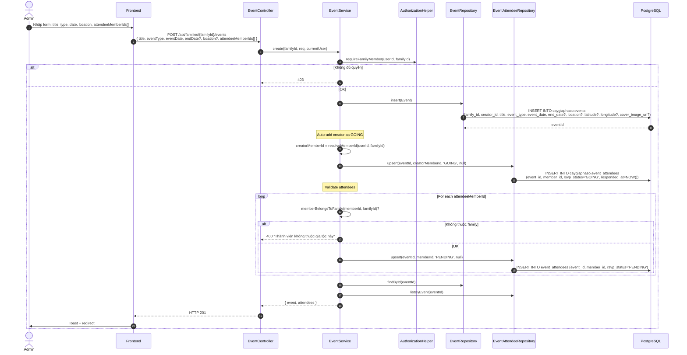
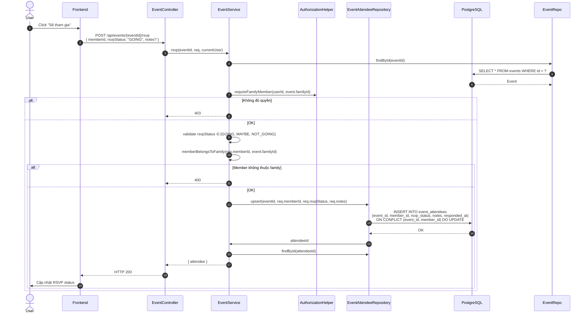
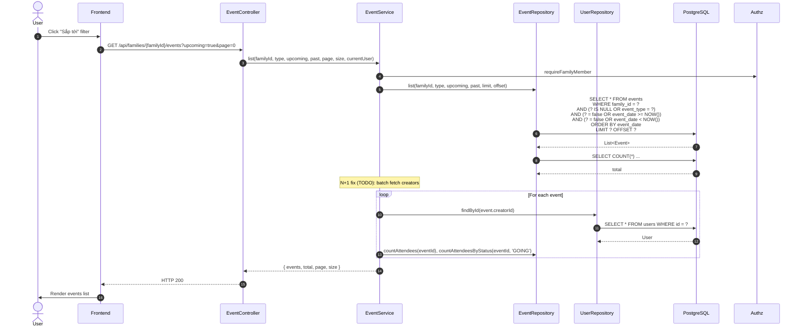

# Luồng 9: Sự kiện gia đình (Events)

## Mô tả nghiệp vụ

Luồng quản lý sự kiện (đám cưới, đám tang, sinh nhật, họp mặt, ...) trong gia tộc:
- Tạo / sửa / xoá sự kiện
- RSVP (GOING / MAYBE / NOT_GOING)
- Album ảnh sự kiện
- Lọc sự kiện sắp tới / đã qua
- Event types: WEDDING, FUNERAL, BIRTHDAY, REUNION, ANNIVERSARY, RELIGIOUS, OTHER

## Sequence Diagram

### 9.1. Tạo sự kiện



### 9.2. RSVP cho sự kiện



### 9.3. List sự kiện có filter



## API Endpoints liên quan

| Method | Path | Mô tả | Auth |
|--------|------|-------|------|
| `GET` | `/api/families/{familyId}/events` | List | ✅ |
| `GET` | `/api/events/{id}` | Detail | ✅ |
| `POST` | `/api/families/{familyId}/events` | Tạo | ✅ |
| `PUT` | `/api/events/{id}` | Sửa | ✅ |
| `DELETE` | `/api/events/{id}` | Xoá | ✅ |
| `POST` | `/api/events/{id}/rsvp` | RSVP | ✅ |
| `GET` | `/api/events/{id}/photos` | Album ảnh | ✅ |
| `POST` | `/api/events/{id}/photos` | Thêm ảnh | ✅ |

## Bảng DB

```sql
CREATE TABLE caygiaphaso.events (
    id UUID PK,
    family_id UUID FK -> families,
    creator_id UUID FK -> users,
    title TEXT,
    event_type TEXT CHECK (IN ('WEDDING','FUNERAL','BIRTHDAY','REUNION','ANNIVERSARY','RELIGIOUS','OTHER')),
    event_date TIMESTAMPTZ,
    end_date TIMESTAMPTZ,
    location TEXT,
    latitude NUMERIC(9,6) CHECK (BETWEEN -90 AND 90),
    longitude NUMERIC(9,6) CHECK (BETWEEN -180 AND 180),
    cover_image_url TEXT,
    CHECK (end_date IS NULL OR end_date >= event_date)
);

CREATE TABLE caygiaphaso.event_attendees (
    event_id UUID FK,
    member_id UUID FK -> family_members,
    rsvp_status TEXT CHECK (IN ('GOING','MAYBE','NOT_GOING','PENDING')),
    notes TEXT,
    responded_at TIMESTAMPTZ,
    UNIQUE (event_id, member_id)
);

CREATE TABLE caygiaphaso.event_photos (
    event_id UUID FK,
    photo_url TEXT,
    caption TEXT,
    uploaded_by UUID FK -> users,
    uploaded_at TIMESTAMPTZ
);
```

## SQL nâng cao

```sql
-- 1. Upcoming events của tất cả families tôi tham gia
SELECT e.*, f.name AS family_name
FROM caygiaphaso.events e
JOIN caygiaphaso.families f ON f.id = e.family_id
WHERE e.event_date > NOW()
  AND f.id IN (
    SELECT family_id FROM caygiaphaso.family_members
    WHERE user_id = '...'
  )
ORDER BY e.event_date
LIMIT 20;

-- 2. Event statistics theo loại
SELECT event_type, COUNT(*) AS total,
       COUNT(*) FILTER (WHERE event_date > NOW()) AS upcoming,
       COUNT(*) FILTER (WHERE event_date <= NOW()) AS past
FROM caygiophaso.events
WHERE family_id = '...'
GROUP BY event_type
ORDER BY total DESC;

-- 3. RSVP summary cho 1 event
SELECT
    e.title,
    COUNT(*) FILTER (WHERE a.rsvp_status = 'GOING') AS going,
    COUNT(*) FILTER (WHERE a.rsvp_status = 'MAYBE') AS maybe,
    COUNT(*) FILTER (WHERE a.rsvp_status = 'NOT_GOING') AS not_going,
    COUNT(*) FILTER (WHERE a.rsvp_status = 'PENDING' OR a.rsvp_status IS NULL) AS pending,
    COUNT(DISTINCT a.member_id) AS total_responded
FROM caygiaphaso.events e
LEFT JOIN caygiophaso.event_attendees a ON a.event_id = e.id
WHERE e.id = '...'
GROUP BY e.id, e.title;

-- 4. Ai đi nhiều event nhất (top attendees)
SELECT
    m.full_name,
    COUNT(*) AS events_attended,
    COUNT(*) FILTER (WHERE a.rsvp_status = 'GOING') AS going_count,
    COUNT(*) FILTER (WHERE a.rsvp_status = 'MAYBE') AS maybe_count
FROM caygiophaso.event_attendees a
JOIN caygiophaso.family_members m ON m.id = a.member_id
WHERE m.family_id = '...'
GROUP BY m.id, m.full_name
ORDER BY going_count DESC
LIMIT 10;

-- 5. Events sắp tới trong 30 ngày tới (cross-family)
SELECT e.*, f.name AS family_name,
       EXTRACT(DAY FROM (e.event_date - NOW())) AS days_until
FROM caygiaphaso.events e
JOIN caygiophaso.families f ON f.id = e.family_id
WHERE e.event_date BETWEEN NOW() AND NOW() + INTERVAL '30 days'
ORDER BY e.event_date;

-- 6. Tìm event trùng ngày (overlap)
SELECT a.title AS event_a, b.title AS event_b,
       a.event_date, b.event_date
FROM caygiophaso.events a, caygiophaso.events b
WHERE a.family_id = b.family_id
  AND a.id < b.id
  AND a.event_date <= COALESCE(b.end_date, b.event_date)
  AND b.event_date <= COALESCE(a.end_date, a.event_date);

-- 7. RSVP response rate (% member đã phản hồi)
SELECT
    e.title,
    e.event_date,
    COUNT(DISTINCT m.id) AS total_members,
    COUNT(DISTINCT a.member_id) AS responded,
    ROUND(100.0 * COUNT(DISTINCT a.member_id) / NULLIF(COUNT(DISTINCT m.id), 0), 1) AS response_rate_pct
FROM caygiophaso.events e
LEFT JOIN caygiophaso.family_members m ON m.family_id = e.family_id
LEFT JOIN caygiophaso.event_attendees a ON a.event_id = e.id AND a.rsvp_status != 'PENDING'
WHERE e.family_id = '...'
GROUP BY e.id, e.title, e.event_date
ORDER BY response_rate_pct DESC NULLS LAST;
```

## Edge cases

1. **Attendee IDOR fix (V4)**: Phải validate `attendeeMemberIds` thuộc family.
2. **Creator auto-GOING**: Khi tạo event, creator tự động được add vào attendees với status GOING.
3. **end_date validation**: CHECK `end_date >= event_date`.
4. **Latitude/Longitude**: NUMERIC(9,6) với CHECK range.
5. **Past events**: Filter `event_date < NOW()`.
6. **Update event**: Chỉ creator hoặc ADMIN family.

## Test cases

### T1: Tạo event
```bash
curl -X POST http://localhost:8080/api/families/{familyId}/events \
  -H "Authorization: Bearer $TOKEN" \
  -d '{
    "title": "Đám cưới A & B",
    "eventType": "WEDDING",
    "eventDate": "2026-12-20T10:00:00Z",
    "location": "Hà Nội",
    "attendeeMemberIds": ["mem1", "mem2"]
  }'
```

### T2: RSVP
```bash
curl -X POST http://localhost:8080/api/events/{eventId}/rsvp \
  -H "Authorization: Bearer $TOKEN" \
  -d '{"memberId":"mem1","rsvpStatus":"GOING"}'
```

### T3: Filter upcoming events
```bash
curl "http://localhost:8080/api/families/{familyId}/events?upcoming=true&page=0&size=20"
```

## Bài học SQL

1. **RSVP ON CONFLICT UPSERT**: `INSERT ... ON CONFLICT (event_id, member_id) DO UPDATE`.
2. **Filter with FILTER clause**: `COUNT(*) FILTER (WHERE ...)` thay cho CASE WHEN.
3. **Overlap detection**: Self-join với điều kiện khoảng thời gian overlap.
4. **Response rate**: Tính % dùng `100.0 * count / total` với NULLIF để tránh divide by zero.
5. **EXTRACT**: Lấy DAY/MONTH/YEAR từ INTERVAL.