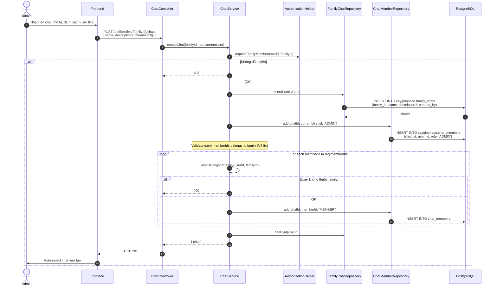
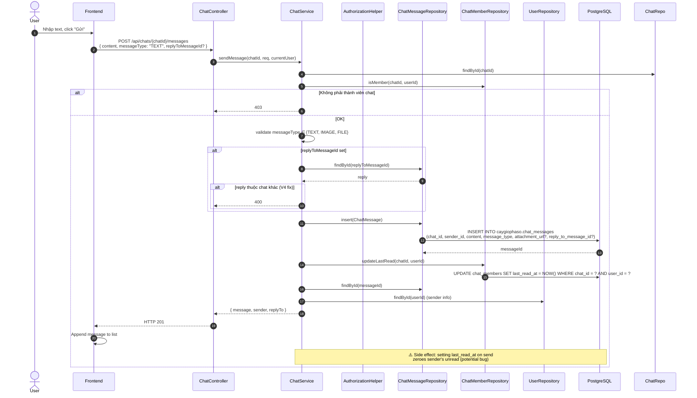

# Luồng 10: Trò chuyện gia đình (Family Chat)

## Mô tả nghiệp vụ

Luồng chat real-time giữa các thành viên trong gia tộc:
- Tạo chat room (1-n)
- Thêm thành viên vào chat
- Gửi tin nhắn (TEXT / IMAGE / FILE)
- Reply tin nhắn (threaded)
- Unread count tracking
- Last-read timestamp

## Sequence Diagram

### 10.1. Tạo chat room



### 10.2. Gửi tin nhắn



### 10.3. List tin nhắn với pagination

```mermaid
sequenceDiagram
    autonumber
    actor User
    participant FE as Frontend
    participant API as ChatController
    participant ChatSvc as ChatService
    participant ChatMemberRepo as ChatMemberRepository
    participant MsgRepo as ChatMessageRepository
    participant UserRepo as UserRepository
    participant DB as PostgreSQL

    User->>FE: Mở chat
    FE->>API: GET /api/chats/{chatId}/messages?before=&limit=50
    API->>ChatSvc: listMessages(chatId, beforeMessageId, limit, currentUser)
    ChatSvc->>ChatMemberRepo: isMember(chatId, userId)

    alt Không phải member
        ChatSvc-->>API: 403
    else OK
        ChatSvc->>MsgRepo: list(chatId, beforeMessageId, limit)
        MsgRepo->>DB: SELECT * FROM caygiophaso.chat_messages<br/>WHERE chat_id = ?<br/>AND (? IS NULL OR created_at < (SELECT created_at FROM chat_messages WHERE id = ?))<br/>AND deleted_at IS NULL<br/>ORDER BY created_at DESC<br/>LIMIT ?
        DB-->>MsgRepo: List<ChatMessage>

        Note over ChatSvc: Batch hydrate sender + reply metadata
        Set senderIds = {m.senderId for m in messages}
        Set replyIds = {m.replyToMessageId for m in messages}
        loop For each senderId
            ChatSvc->>UserRepo: findById(senderId)
        end
        loop For each replyId
            ChatSvc->>MsgRepo: findById(replyId)
        end

        ChatSvc->>ChatMemberRepo: updateLastRead(chatId, userId) (mark as read)
        ChatSvc-->>API: { messages: [{message, sender, replyTo}, ...] }
        API-->>FE: HTTP 200
        FE->>User: Render messages
    end
```

## API Endpoints liên quan

| Method | Path | Mô tả | Auth |
|--------|------|-------|------|
| `GET` | `/api/families/{familyId}/chats` | List chats | ✅ |
| `POST` | `/api/families/{familyId}/chats` | Tạo chat | ✅ |
| `GET` | `/api/chats/{chatId}/messages` | List messages | ✅ |
| `POST` | `/api/chats/{chatId}/messages` | Gửi message | ✅ |

## Bảng DB

```sql
CREATE TABLE caygiophaso.family_chats (
    id UUID PK,
    family_id UUID FK -> families,
    name TEXT,
    description TEXT,
    created_by UUID FK -> users
);

CREATE TABLE caygiophaso.chat_members (
    chat_id UUID FK,
    user_id UUID FK -> users (CASCADE),
    role TEXT CHECK (IN ('MEMBER','ADMIN')) DEFAULT 'MEMBER',
    joined_at TIMESTAMPTZ,
    last_read_at TIMESTAMPTZ,
    UNIQUE (chat_id, user_id)
);

CREATE TABLE caygiophaso.chat_messages (
    id UUID PK,
    chat_id UUID FK -> family_chats (CASCADE),
    sender_id UUID FK -> users (SET NULL),
    content TEXT,  -- required for TEXT/SYSTEM, NULL for IMAGE/FILE
    message_type TEXT CHECK (IN ('TEXT','IMAGE','FILE','SYSTEM')),
    attachment_url TEXT,
    reply_to_message_id UUID FK -> chat_messages (SET NULL),
    edited_at TIMESTAMPTZ,
    deleted_at TIMESTAMPTZ
);
```

## SQL mẫu

```sql
-- 1. Unread count cho mỗi chat của user
SELECT
    c.id AS chat_id,
    c.name,
    COUNT(m.id) FILTER (WHERE m.created_at > cm.last_read_at) AS unread_count,
    cm.last_read_at
FROM caygiophaso.family_chats c
JOIN caygiophaso.chat_members cm ON cm.chat_id = c.id
LEFT JOIN caygiophaso.chat_messages m ON m.chat_id = c.id
WHERE cm.user_id = '...'
GROUP BY c.id, c.name, cm.last_read_at
ORDER BY unread_count DESC;

-- 2. Last message cho mỗi chat
SELECT DISTINCT ON (c.id)
    c.id AS chat_id,
    c.name,
    m.content AS last_message,
    m.sender_id AS last_sender,
    m.message_type,
    m.created_at AS last_message_at
FROM caygiophaso.family_chats c
LEFT JOIN caygiophaso.chat_messages m ON m.chat_id = c.id AND m.deleted_at IS NULL
ORDER BY c.id, m.created_at DESC;

-- 3. Top chatters
SELECT
    u.email,
    u.full_name,
    COUNT(*) AS messages_sent,
    COUNT(DISTINCT m.chat_id) AS unique_chats
FROM caygiophaso.chat_messages m
JOIN caygiophaso.users u ON u.id = m.sender_id
WHERE m.created_at > NOW() - INTERVAL '30 days'
GROUP BY u.id, u.email, u.full_name
ORDER BY messages_sent DESC
LIMIT 10;

-- 4. Threads (reply chains)
WITH RECURSIVE thread AS (
    SELECT id, reply_to_message_id, content, sender_id, 0 AS depth
    FROM caygiophaso.chat_messages
    WHERE chat_id = '...' AND reply_to_message_id IS NULL

    UNION ALL

    SELECT cm.id, cm.reply_to_message_id, cm.content, cm.sender_id, t.depth + 1
    FROM caygiophaso.chat_messages cm
    JOIN thread t ON cm.reply_to_message_id = t.id
)
SELECT depth, COUNT(*) AS messages
FROM thread
GROUP BY depth
ORDER BY depth;

-- 5. Daily message volume (heatmap)
SELECT
    DATE(created_at) AS day,
    COUNT(*) AS message_count
FROM caygiophaso.chat_messages
WHERE chat_id = '...'
  AND created_at > NOW() - INTERVAL '90 days'
GROUP BY DATE(created_at)
ORDER BY day;

-- 6. Image/File messages
SELECT *
FROM caygiophaso.chat_messages
WHERE chat_id = '...'
  AND message_type IN ('IMAGE', 'FILE')
  AND attachment_url IS NOT NULL
ORDER BY created_at DESC
LIMIT 50;
```

## Edge cases

1. **Sender NULL**: `sender_id ON DELETE SET NULL` - khi user bị xoá, tin nhắn giữ nguyên content nhưng sender thành NULL.
2. **Reply chain**: V4 fix: `replyToMessageId` phải thuộc cùng chat.
3. **Chat deletion**: Cascade tất cả messages.
4. **last_read_at on send**: Side effect không mong muốn - sender's unread count = 0 ngay sau khi gửi.
5. **Soft delete message**: `deleted_at` thay vì DELETE.
6. **Content validation (V4)**: TEXT/SYSTEM phải có content, IMAGE/FILE phải có attachment_url.

## Test cases

### T1: Tạo chat
```bash
curl -X POST http://localhost:8080/api/families/{familyId}/chats \
  -H "Authorization: Bearer $TOKEN" \
  -d '{"name":"General","memberIds":["user1","user2"]}'
```

### T2: Gửi message
```bash
curl -X POST http://localhost:8080/api/chats/{chatId}/messages \
  -H "Authorization: Bearer $TOKEN" \
  -d '{"content":"Hello!","messageType":"TEXT"}'
```

### T3: Reply với cross-chat ID
```bash
# replyToMessageId thuộc chat khác → 400
curl -X POST http://localhost:8080/api/chats/{chatA}/messages \
  -d '{"content":"hi","replyToMessageId":"MSG_IN_CHAT_B"}'
```

## Bài học SQL

1. **DISTINCT ON**: Lấy 1 row per group (PostgreSQL-specific).
2. **Window functions**: `ROW_NUMBER() OVER (PARTITION BY chat_id ORDER BY created_at DESC)` để rank messages.
3. **Recursive CTE**: Threaded replies.
4. **FILTER clause**: Count with conditions cleaner than CASE WHEN.
5. **Cursor pagination**: Dùng `created_at < (SELECT ...)` cho pagination sâu.