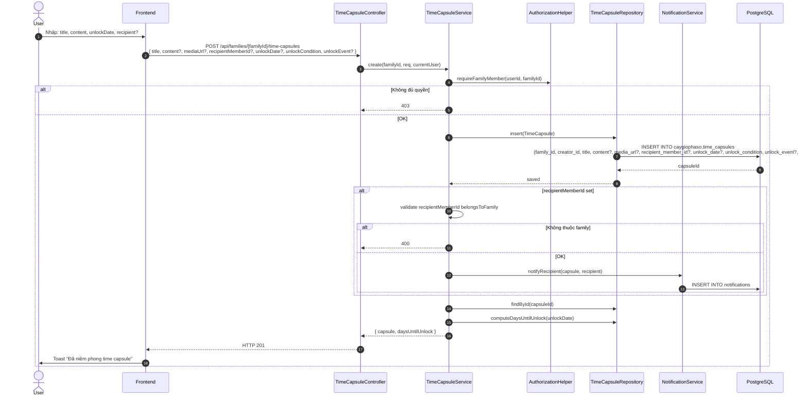
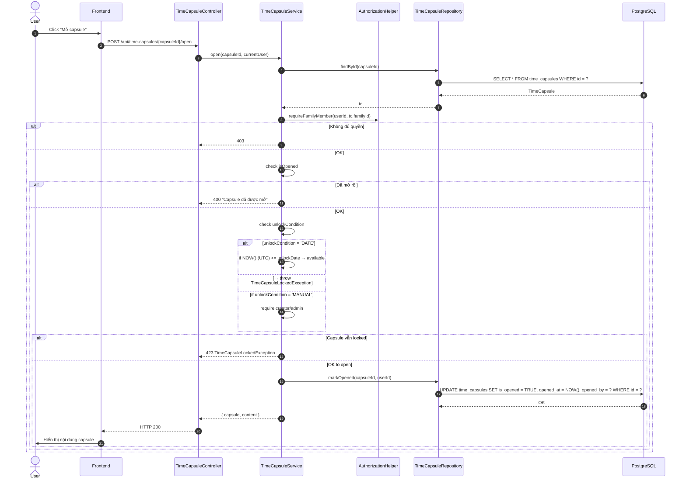
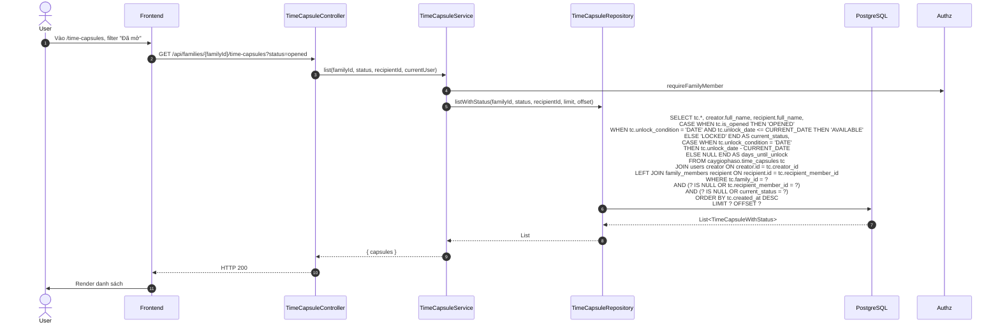

# Luồng 11: Capsules thời gian (Time Capsules)

## Mô tả nghiệp vụ

**Tính năng độc đáo #2**: Gửi tin nhắn/video/ảnh cho tương lai, được "seal" và chỉ mở khi đến đúng thời điểm.

3 chế độ unlock:
- **DATE**: mở sau ngày cụ thể
- **EVENT**: mở khi đến sự kiện gia đình (manual trigger)
- **MANUAL**: mở thủ công bởi creator/admin

Trạng thái:
- **LOCKED**: chưa đến unlock date
- **AVAILABLE**: đã đến unlock date nhưng chưa mở
- **OPENED**: đã mở

## Sequence Diagram

### 11.1. Tạo time capsule



### 11.2. Mở time capsule



### 11.3. List time capsules (với status filter)



## API Endpoints

| Method | Path | Mô tả | Auth |
|--------|------|-------|------|
| `GET` | `/api/families/{familyId}/time-capsules` | List | ✅ |
| `GET` | `/api/time-capsules/{id}` | Detail | ✅ |
| `POST` | `/api/families/{familyId}/time-capsules` | Tạo | ✅ |
| `POST` | `/api/time-capsules/{id}/open` | Mở | ✅ |
| `DELETE` | `/api/time-capsules/{id}` | Xoá | ✅ |

## Bảng DB

```sql
CREATE TABLE caygiophaso.time_capsules (
    id UUID PK,
    family_id UUID FK -> families,
    creator_id UUID FK -> users,
    title TEXT,
    content TEXT,
    media_url TEXT,
    recipient_member_id UUID FK -> family_members (SET NULL),
    unlock_date DATE,
    unlock_condition TEXT CHECK (IN ('DATE','EVENT','MANUAL')),
    unlock_event TEXT,
    is_opened BOOLEAN DEFAULT FALSE,
    opened_at TIMESTAMPTZ,
    opened_by UUID FK -> users (SET NULL),
    CHECK (unlock_condition != 'DATE' OR unlock_date IS NOT NULL)
);
```

## SQL mẫu

```sql
-- 1. Tất cả capsules với status hiện tại
SELECT
    id, title,
    CASE
        WHEN is_opened THEN 'OPENED'
        WHEN unlock_condition = 'DATE' AND unlock_date <= CURRENT_DATE THEN 'AVAILABLE'
        ELSE 'LOCKED'
    END AS current_status,
    CASE
        WHEN unlock_condition = 'DATE' THEN unlock_date - CURRENT_DATE
        ELSE NULL
    END AS days_until_unlock
FROM caygiophaso.time_capsules
WHERE family_id = '...'
ORDER BY created_at DESC;

-- 2. Capsules sắp đến hạn trong 7 ngày
SELECT *
FROM caygiophaso.time_capsules
WHERE family_id = '...'
  AND is_opened = FALSE
  AND unlock_condition = 'DATE'
  AND unlock_date BETWEEN CURRENT_DATE AND CURRENT_DATE + INTERVAL '7 days'
ORDER BY unlock_date;

-- 3. Capsules quá hạn chưa mở
SELECT *
FROM caygiophaso.time_capsules
WHERE family_id = '...'
  AND is_opened = FALSE
  AND unlock_condition = 'DATE'
  AND unlock_date < CURRENT_DATE
ORDER BY unlock_date;

-- 4. Capsules cho recipient X
SELECT tc.*, creator.full_name AS creator_name
FROM caygiophaso.time_capsules tc
JOIN caygiophaso.users creator ON creator.id = tc.creator_id
WHERE tc.family_id = '...'
  AND tc.recipient_member_id = 'RECIPIENT_ID'
ORDER BY tc.unlock_date NULLS LAST;

-- 5. Capsules đã mở + nội dung (audit)
SELECT
    tc.title,
    tc.content,
    creator.full_name AS opened_by_creator,
    opener.full_name AS opened_by_user,
    tc.opened_at,
    EXTRACT(DAY FROM (tc.opened_at - tc.created_at)) AS days_from_creation
FROM caygiophaso.time_capsules tc
JOIN caygiophaso.users creator ON creator.id = tc.creator_id
LEFT JOIN caygiophaso.users opener ON opener.id = tc.opened_by
WHERE tc.is_opened = TRUE
ORDER BY tc.opened_at DESC;

-- 6. Capsules grouped by unlock condition
SELECT
    unlock_condition,
    COUNT(*) AS total,
    COUNT(*) FILTER (WHERE is_opened) AS opened,
    COUNT(*) FILTER (WHERE NOT is_opened AND unlock_condition = 'DATE' AND unlock_date <= CURRENT_DATE) AS available
FROM caygiophaso.time_capsules
WHERE family_id = '...'
GROUP BY unlock_condition;

-- 7. Time capsules by year (timeline)
SELECT
    EXTRACT(YEAR FROM unlock_date) AS year,
    COUNT(*) AS capsules_count
FROM caygiophaso.time_capsules
WHERE family_id = '...' AND unlock_date IS NOT NULL
GROUP BY EXTRACT(YEAR FROM unlock_date)
ORDER BY year;
```

## Edge cases & luật phân quyền

1. **Recipient family check (V4 fix)**: `recipientMemberId` phải thuộc cùng family.
2. **Timezone consistency (V4 fix)**: Sử dụng UTC thống nhất giữa Java và PostgreSQL.
3. **Mark opened race**: 2 concurrent opens có thể overwrite (cần conditional UPDATE).
4. **Lock semantics**: DATE unlock so sánh với `CURRENT_DATE` ở SQL, `LocalDate.now()` ở Java.
5. **Manual unlock**: Chỉ creator hoặc ADMIN family mới mở được MANUAL capsule.
6. **EVENT unlock**: Hiện tại chưa implement (sẽ trigger manual khi event hoàn thành).

## Test cases

### T1: Tạo capsule cho tương lai
```bash
# unlock_date = 2027-01-01 (năm sau)
curl -X POST http://localhost:8080/api/families/{familyId}/time-capsules \
  -H "Authorization: Bearer $TOKEN" \
  -d '{
    "title": "Gửi các con năm 2027",
    "content": "Chúc các con học giỏi...",
    "unlockDate": "2027-01-01",
    "unlockCondition": "DATE"
  }'
```

### T2: Mở capsule quá hạn
```bash
# unlock_date = 2025-01-01 (quá hạn)
curl -X POST http://localhost:8080/api/time-capsules/{capsuleId}/open
```
Expected: HTTP 200, trả về content.

### T3: Mở capsule chưa đến hạn
```bash
# unlock_date = 2030-01-01
curl -X POST http://localhost:8080/api/time-capsules/{capsuleId}/open
```
Expected: HTTP 423 (Locked) hoặc 400.

### T4: List capsules grouped
```bash
curl "http://localhost:8080/api/families/{familyId}/time-capsules?status=available"
```

## Bài học SQL

1. **Computed columns trong SELECT**: CASE WHEN cho status, days_until.
2. **CURRENT_DATE**: Built-in cho "today" theo timezone của server.
3. **EXTRACT + INTERVAL**: Tính số ngày còn lại.
4. **Conditional aggregate**: `COUNT(*) FILTER (WHERE ...)` thay cho CASE.
5. **Time arithmetic**: `current_date - unlock_date` trả về INTERVAL (số ngày).
6. **Audit tracking**: `created_at`, `opened_at`, `opened_by` cho traceability.