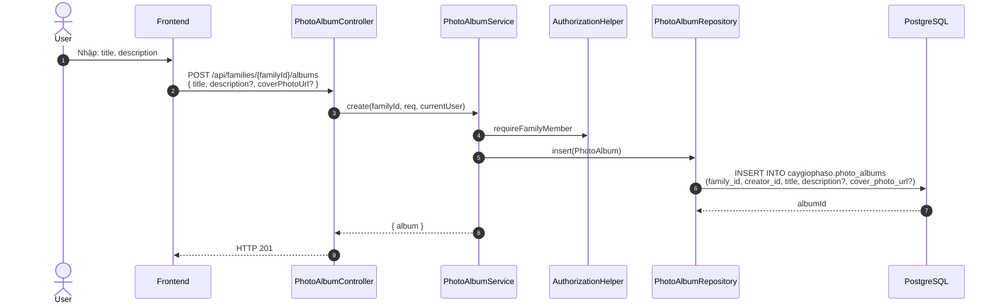
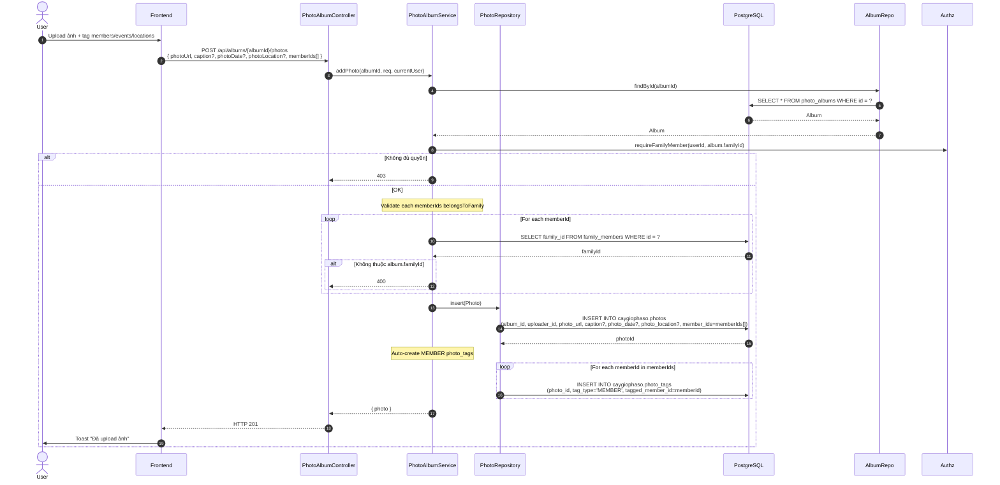
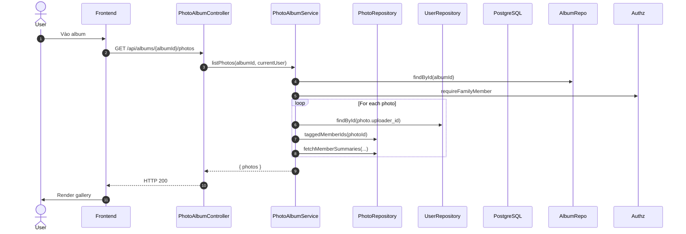

# Luồng 12: Album ảnh gia đình (Photo Albums)

## Mô tả nghiệp vụ

Luồng quản lý album ảnh gia đình:
- Tạo album (title, description, cover_photo_url?)
- Upload ảnh vào album (photo_url, caption, photo_date, photo_location, member_ids[])
- Tag ảnh theo member / event / location (polymorphic tags)
- Hiển thị ảnh với face recognition (planned)

## Sequence Diagram

### 12.1. Tạo album



### 12.2. Upload ảnh với tags



### 12.3. List photos trong album



## API Endpoints

| Method | Path | Mô tả | Auth |
|--------|------|-------|------|
| `GET` | `/api/families/{familyId}/albums` | List albums | ✅ |
| `POST` | `/api/families/{familyId}/albums` | Tạo album | ✅ |
| `GET` | `/api/albums/{albumId}/photos` | List photos | ✅ |
| `POST` | `/api/albums/{albumId}/photos` | Upload photo | ✅ |

## Bảng DB

```sql
CREATE TABLE caygiophaso.photo_albums (
    id UUID PK,
    family_id UUID FK -> families,
    creator_id UUID FK -> users,
    title TEXT,
    description TEXT,
    cover_photo_url TEXT
);

CREATE TABLE caygiophaso.photos (
    id UUID PK,
    album_id UUID FK -> photo_albums,
    uploader_id UUID FK -> users,
    photo_url TEXT,
    caption TEXT,
    photo_date DATE,
    photo_location TEXT,
    member_ids UUID[]  -- inline array for fast query
);

CREATE TABLE caygiophaso.photo_tags (
    id UUID PK,
    photo_id UUID FK -> photos,
    tag_type TEXT CHECK (IN ('MEMBER','LOCATION','EVENT')),
    tagged_member_id UUID FK -> family_members (CASCADE),
    tagged_event_id UUID FK -> events (CASCADE),
    tag_value TEXT,  -- V4: for LOCATION tags
    CHECK (consistent with tag_type)
);
```

## SQL mẫu

```sql
-- 1. Tất cả albums của family
SELECT id, title, description, cover_photo_url, created_at
FROM caygiophaso.photo_albums
WHERE family_id = '...'
ORDER BY created_at DESC;

-- 2. Albums nhiều ảnh nhất
SELECT a.id, a.title, COUNT(p.id) AS photo_count
FROM caygiophaso.photo_albums a
LEFT JOIN caygiophaso.photos p ON p.album_id = a.id
WHERE a.family_id = '...'
GROUP BY a.id, a.title
ORDER BY photo_count DESC
LIMIT 10;

-- 3. Tất cả ảnh có tag member X
SELECT p.*
FROM caygiophaso.photos p
WHERE p.album_id IN (
  SELECT id FROM caygiophaso.photo_albums WHERE family_id = '...'
)
AND 'MEMBER_X' = ANY(p.member_ids)
ORDER BY p.photo_date DESC NULLS LAST;

-- 4. Photos by event
SELECT p.*
FROM caygiophaso.photos p
JOIN caygiophaso.photo_tags pt ON pt.photo_id = p.id
WHERE pt.tag_type = 'EVENT' AND pt.tagged_event_id = 'EVENT_ID'
ORDER BY p.created_at;

-- 5. Timeline ảnh theo photo_date
SELECT p.id, p.photo_url, p.caption, p.photo_date, a.title AS album_title
FROM caygiophaso.photos p
JOIN caygiophaso.photo_albums a ON a.id = p.album_id
WHERE a.family_id = '...'
  AND p.photo_date IS NOT NULL
ORDER BY p.photo_date DESC
LIMIT 50;

-- 6. Top tagged members
SELECT m.full_name, COUNT(*) AS photo_count
FROM caygiophaso.photo_tags pt
JOIN caygiophaso.photos p ON p.id = pt.photo_id
JOIN caygiophaso.photo_albums a ON a.id = p.album_id
JOIN caygiophaso.family_members m ON m.id = pt.tagged_member_id
WHERE a.family_id = '...' AND pt.tag_type = 'MEMBER'
GROUP BY m.id, m.full_name
ORDER BY photo_count DESC
LIMIT 10;

-- 7. Locations từ LOCATION tags (V4: tag_value column)
SELECT tag_value AS location, COUNT(*) AS photo_count
FROM caygiophaso.photo_tags pt
JOIN caygiophaso.photos p ON p.id = pt.photo_id
JOIN caygiophaso.photo_albums a ON a.id = p.album_id
WHERE a.family_id = '...' AND pt.tag_type = 'LOCATION' AND pt.tag_value IS NOT NULL
GROUP BY tag_value
ORDER BY photo_count DESC;
```

## Edge cases

1. **IDOR fix (V4)**: `memberIds` phải thuộc cùng album.familyId.
2. **Polymorphic tags**: 1 tag chỉ thuộc 1 type (CHECK constraint).
3. **Location tags**: V4 thêm `tag_value` TEXT.
4. **Inline member_ids**: Redundant với photo_tags nhưng giúp query nhanh (GIN index).
5. **Cascade delete**: Album → photos → photo_tags cascade.

## Bài học SQL

1. **UUID array**: `= ANY(array)` cho membership query.
2. **Polymorphic FK**: Multiple nullable FKs + CHECK constraint.
3. **GIN index**: Cho array containment queries.
4. **Inline vs separate table**: Trade-off giữa redundancy (member_ids[]) và normalization (photo_tags).
5. **CHECK với subquery**: PostgreSQL không cho phép - dùng trigger nếu cần cross-table check.