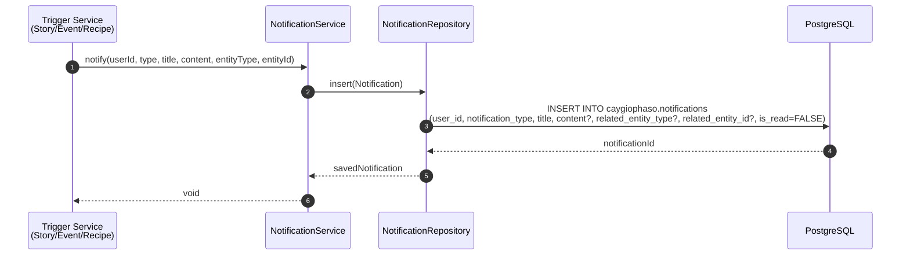
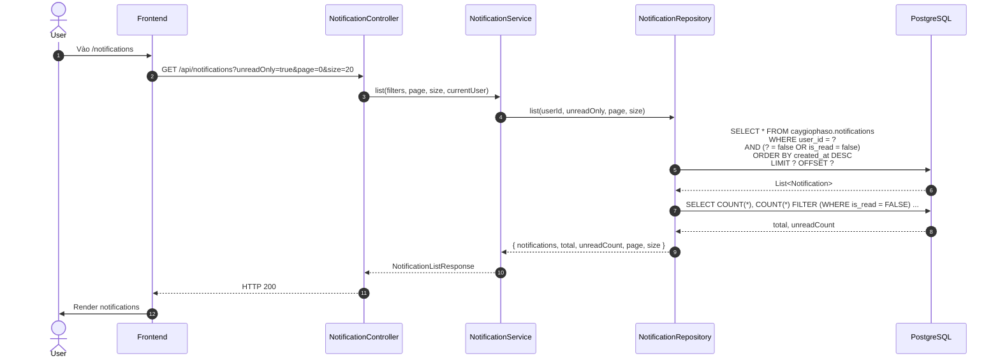
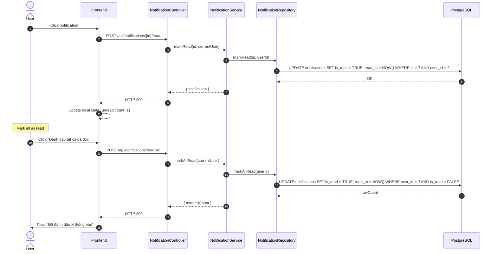

# Luồng 13: Thông báo (Notifications)

## Mô tả nghiệp vụ

Luồng quản lý in-app notifications:
- Tạo notification khi user bị tag trong story/recipe/event/time-capsule
- List notifications (filter unread only)
- Mark as read (single + all)
- Real-time notification count (badge trên TopBar)

## Sequence Diagram

### 13.1. Tạo notification (event-driven)



### 13.2. List notifications



### 13.3. Mark as read



## API Endpoints

| Method | Path | Mô tả | Auth |
|--------|------|-------|------|
| `GET` | `/api/notifications` | List | ✅ |
| `POST` | `/api/notifications/{id}/read` | Mark 1 | ✅ |
| `POST` | `/api/notifications/read-all` | Mark all | ✅ |

## Bảng DB

```sql
CREATE TABLE caygiophaso.notifications (
    id UUID PK,
    user_id UUID FK -> users (CASCADE),
    notification_type TEXT,
    title TEXT,
    content TEXT,
    related_entity_type TEXT,
    related_entity_id UUID,
    is_read BOOLEAN DEFAULT FALSE,
    read_at TIMESTAMPTZ,
    created_at TIMESTAMPTZ
);
```

## SQL mẫu

```sql
-- 1. Unread count cho user
SELECT COUNT(*) AS unread_count
FROM caygiophaso.notifications
WHERE user_id = '...' AND is_read = FALSE;

-- 2. Notification types breakdown
SELECT notification_type, COUNT(*) AS total,
       COUNT(*) FILTER (WHERE is_read = FALSE) AS unread
FROM caygiophaso.notifications
WHERE user_id = '...'
GROUP BY notification_type
ORDER BY total DESC;

-- 3. Notifications gần đây (7 ngày qua)
SELECT *
FROM caygiophaso.notifications
WHERE user_id = '...' AND created_at > NOW() - INTERVAL '7 days'
ORDER BY created_at DESC;

-- 4. Top users nhận nhiều notification nhất
SELECT u.email, u.full_name, COUNT(*) AS notif_count
FROM caygiophaso.notifications n
JOIN caygiophaso.users u ON u.id = n.user_id
WHERE n.created_at > NOW() - INTERVAL '30 days'
GROUP BY u.id, u.email, u.full_name
ORDER BY notif_count DESC
LIMIT 10;

-- 5. Notification activity heatmap
SELECT
    DATE_TRUNC('hour', created_at) AS hour_bucket,
    COUNT(*) AS notif_count
FROM caygiophaso.notifications
WHERE user_id = '...' AND created_at > NOW() - INTERVAL '7 days'
GROUP BY DATE_TRUNC('hour', created_at)
ORDER BY hour_bucket;

-- 6. Cleanup old read notifications
DELETE FROM caygiophaso.notifications
WHERE is_read = TRUE AND read_at < NOW() - INTERVAL '90 days';
```

## Edge cases

1. **Polymorphic reference**: `related_entity_type` + `related_entity_id` không có FK (by design).
2. **CASCADE delete**: Xoá user → xoá tất cả notifications.
3. **Composite index**: `(user_id, created_at DESC)` cho list nhanh (V4).
4. **Partial index unread**: `(user_id, created_at DESC) WHERE is_read = FALSE`.
5. **Owner check**: Mark read chỉ áp dụng cho notification của chính user đó.

## Bài học SQL

1. **Polymorphic references**: Không FK nhưng có type constraint.
2. **Partial index**: Chỉ index rows thỏa điều kiện (smaller, faster).
3. **Cleanup jobs**: Scheduled job xoá notification cũ (đã đọc > 90 ngày).
4. **DATE_TRUNC**: Bucket time cho phân tích.
5. **CASCADE**: User bị xoá → notifications tự xoá.