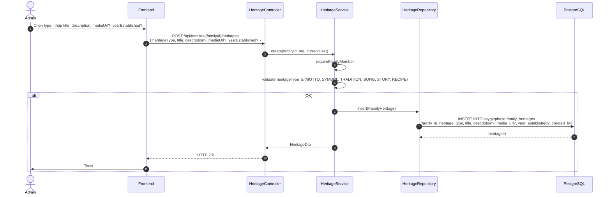

# Luồng 14: Di sản & Truyền thống (Heritage)

## Mô tả nghiệp vụ

Luồng quản lý di sản văn hoá gia tộc:
- 6 loại heritage: MOTTO (gia huấn), SYMBOL (biểu tượng), TRADITION (tập quán), SONG (bài hát), STORY (truyền thuyết), RECIPE (công thức đặc trưng)
- Tạo / xem heritage của gia tộc

## Sequence Diagram

### 14.1. Tạo heritage



## API Endpoints

| Method | Path | Mô tả | Auth |
|--------|------|-------|------|
| `GET` | `/api/families/{familyId}/heritages` | List | ✅ |
| `POST` | `/api/families/{familyId}/heritages` | Tạo | ✅ |

## Bảng DB

```sql
CREATE TABLE caygiophaso.family_heritages (
    id UUID PK,
    family_id UUID FK -> families,
    heritage_type TEXT CHECK (IN ('MOTTO','SYMBOL','TRADITION','SONG','STORY','RECIPE')),
    title TEXT,
    description TEXT,
    media_url TEXT,
    year_established INTEGER CHECK (> 0),
    created_by UUID FK -> users
);
```

## SQL mẫu

```sql
-- 1. Tất cả heritages của family, group by type
SELECT heritage_type, COUNT(*) AS total
FROM caygiophaso.family_heritages
WHERE family_id = '...'
GROUP BY heritage_type
ORDER BY total DESC;

-- 2. Heritages lâu đời nhất (year_established sớm nhất)
SELECT title, heritage_type, year_established
FROM caygiophaso.family_heritages
WHERE family_id = '...'
  AND year_established IS NOT NULL
ORDER BY year_established ASC
LIMIT 10;

-- 3. Motto + Symbol của mỗi family
SELECT family_id, title, description
FROM caygiophaso.family_heritages
WHERE heritage_type IN ('MOTTO', 'SYMBOL')
ORDER BY family_id, heritage_type;

-- 4. Search heritages theo title
SELECT *
FROM caygiophaso.family_heritages
WHERE family_id = '...' AND title ILIKE '%phong tục%'
ORDER BY year_established NULLS LAST;

-- 5. Heritages có media (audio/video/image)
SELECT *
FROM caygiophaso.family_heritages
WHERE family_id = '...' AND media_url IS NOT NULL;
```

## Bài học SQL

1. **CHECK constraint enum**: heritage_type ở DB layer.
2. **Multi-type collection**: 1 family có thể có nhiều MOTTO, nhiều TRADITION.
3. **JSONB-like flexibility**: media_url cho cả IMAGE/VIDEO/AUDIO.