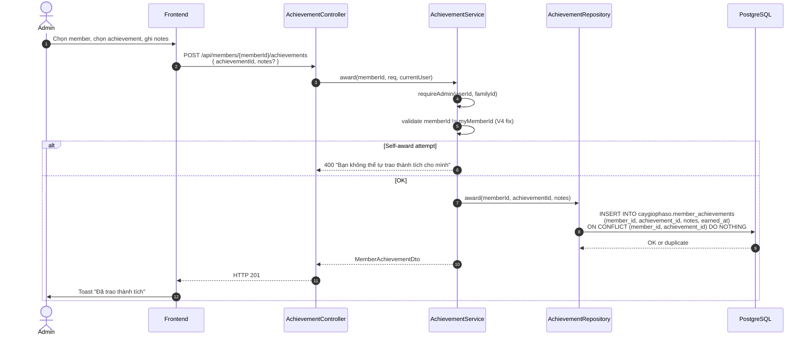
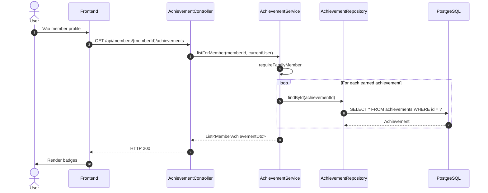

# Luồng 15: Thành tích (Achievements)

## Mô tả nghiệp vụ

Luồng quản lý thành tích (gamification):
- Định nghĩa achievements (code, name, description, icon_url, points)
- Award achievement cho member (ADMIN only)
- List achievements của 1 member
- Self-award prevention

## Sequence Diagram

### 15.1. Award achievement



### 15.2. List achievements của member



## API Endpoints

| Method | Path | Mô tả | Auth |
|--------|------|-------|------|
| `GET` | `/api/achievements` | List all | ✅ |
| `GET` | `/api/members/{memberId}/achievements` | List của member | ✅ |
| `POST` | `/api/members/{memberId}/achievements` | Award (ADMIN) | ✅ |

## Bảng DB

```sql
CREATE TABLE caygiophaso.achievements (
    id UUID PK,
    code TEXT UNIQUE,
    name TEXT,
    description TEXT,
    icon_url TEXT,
    points INTEGER DEFAULT 0 CHECK (>= 0)
);

CREATE TABLE caygiophaso.member_achievements (
    id UUID PK,
    member_id UUID FK -> family_members (CASCADE),
    achievement_id UUID FK -> achievements (CASCADE),
    earned_at TIMESTAMPTZ,
    notes TEXT,
    UNIQUE (member_id, achievement_id)
);
```

## SQL mẫu

```sql
-- 1. Top members theo tổng điểm achievement
SELECT
    m.full_name,
    COUNT(ma.id) AS achievement_count,
    SUM(a.points) AS total_points
FROM caygiophaso.family_members m
JOIN caygiophaso.member_achievements ma ON ma.member_id = m.id
JOIN caygiophaso.achievements a ON a.id = ma.achievement_id
WHERE m.family_id = '...'
GROUP BY m.id, m.full_name
ORDER BY total_points DESC NULLS LAST
LIMIT 10;

-- 2. Achievements phổ biến nhất
SELECT a.code, a.name, COUNT(ma.id) AS earned_count
FROM caygiophaso.achievements a
LEFT JOIN caygiophaso.member_achievements ma ON ma.achievement_id = a.id
GROUP BY a.id, a.code, a.name
ORDER BY earned_count DESC;

-- 3. Achievements chưa ai đạt được
SELECT a.*
FROM caygiophaso.achievements a
LEFT JOIN caygiophaso.member_achievements ma ON ma.achievement_id = a.id
WHERE ma.id IS NULL;

-- 4. Achievements được trao gần đây
SELECT
    ma.earned_at,
    m.full_name AS member,
    a.name AS achievement,
    ma.notes,
    u.full_name AS awarded_by
FROM caygiophaso.member_achievements ma
JOIN caygiophaso.family_members m ON m.id = ma.member_id
JOIN caygiophaso.achievements a ON a.id = ma.achievement_id
JOIN caygiophaso.users u ON u.id = m.user_id
WHERE m.family_id = '...'
ORDER BY ma.earned_at DESC
LIMIT 50;

-- 5. Member chưa có achievement nào
SELECT m.*
FROM caygiophaso.family_members m
WHERE m.family_id = '...'
  AND NOT EXISTS (
    SELECT 1 FROM caygiophaso.member_achievements ma
    WHERE ma.member_id = m.id
  );
```

## Edge cases

1. **Self-award prevention (V4 fix)**: Admin không thể trao cho chính mình.
2. **Unique constraint**: Mỗi member chỉ có 1 bản ghi per achievement.
3. **Idempotent insert**: `ON CONFLICT DO NOTHING` tránh duplicate.
4. **Authorization**: Chỉ ADMIN family mới được trao.
5. **Cascade delete**: Member bị xoá → mất achievements.

## Bài học SQL

1. **ON CONFLICT DO NOTHING**: Idempotent insert.
2. **Anti-join**: `NOT EXISTS` để tìm rows chưa có relation.
3. **LEFT JOIN + IS NULL**: Tương đương NOT EXISTS nhưng cú pháp khác.
4. **SUM aggregate**: Tính tổng điểm qua nhiều bảng.